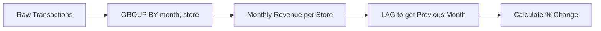
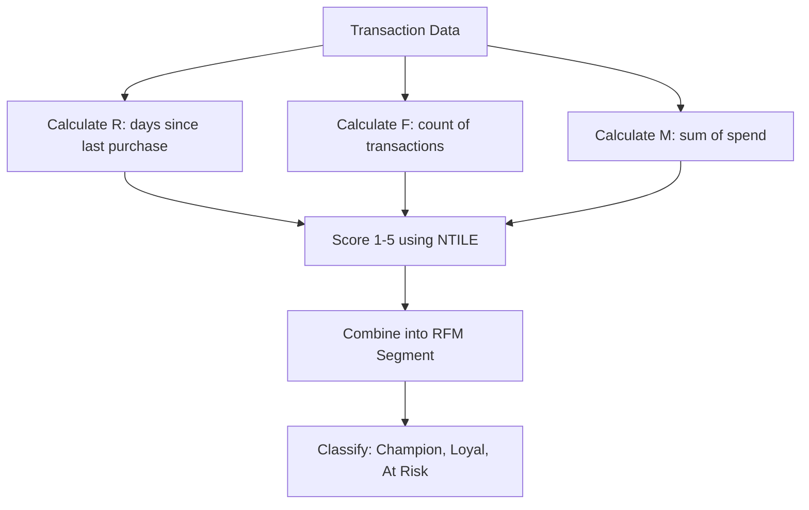

# Day 1 - SQL (The Gatekeeper)

**Objective:** Master the SQL skills needed to pass dunnhumby's technical screening—window functions, aggregations, JOINs, and retail-specific queries.

> **All code blocks include detailed inline comments and are followed by a line-by-line plain-English explanation.**

---

## Time Budget

| Block | Duration | Focus |
|-------|----------|-------|
| Morning | 2.5 hours | Core SQL concepts + JOINs |
| Afternoon | 2.5 hours | Window functions + Aggregations |
| Evening | 2 hours | Practice problems + Mock interview |
| **Total** | **7 hours** | |

**Micro-blocks:** 45 min study → 10 min break → repeat

---

## Topics Covered

1. SELECT, WHERE, ORDER BY fundamentals
2. JOINs (INNER, LEFT, RIGHT, FULL, SELF)
3. GROUP BY and Aggregate Functions
4. Window Functions (ROW_NUMBER, RANK, DENSE_RANK, LAG, LEAD, SUM OVER)
5. Subqueries and CTEs
6. Retail SQL Patterns (Top N per group, RFM, YoY comparisons)

---

## Topic 1: SELECT, WHERE, ORDER BY Fundamentals

### Plain-English Explanation
Every SQL query starts with SELECT (what columns you want), FROM (which table), and optionally WHERE (filter rows), ORDER BY (sort results). Think of it as: "Get me *these columns* from *this table* where *this condition* is true, sorted by *this*."

### Step-by-Step Learning Checklist
- [ ] Write a query selecting all columns from a table
- [ ] Write a query selecting specific columns
- [ ] Add a WHERE clause with numeric comparison
- [ ] Add a WHERE clause with string matching (LIKE)
- [ ] Sort results ascending and descending

### What to Say in Interview
> "I always start by understanding the grain of the data—what does one row represent? Then I filter to the relevant subset before any aggregation."

### Common Pitfalls
- **Pitfall:** Using `=` for NULL checks → **Fix:** Use `IS NULL` or `IS NOT NULL`
- **Pitfall:** Forgetting quotes around strings → **Fix:** String literals need single quotes: `'value'`
- **Pitfall:** Case sensitivity in LIKE → **Fix:** Use `LOWER()` or `ILIKE` (PostgreSQL)

### Sample Schema and Data

```sql
-- TRANSACTIONS TABLE
-- This table stores individual purchase transactions at a retail store
-- Each row = one product purchased in one transaction

CREATE TABLE transactions (
    txn_id INT,           -- Unique transaction identifier
    customer_id INT,      -- Customer who made the purchase
    product_id INT,       -- Product purchased
    store_id INT,         -- Store where purchase happened
    txn_date DATE,        -- Date of transaction
    quantity INT,         -- Number of units purchased
    unit_price DECIMAL(10,2)  -- Price per unit
);
```

**Sample Data (8 rows):**

| txn_id | customer_id | product_id | store_id | txn_date   | quantity | unit_price |
|--------|-------------|------------|----------|------------|----------|------------|
| 1      | 101         | 501        | 1        | 2024-01-15 | 2        | 3.99       |
| 2      | 102         | 502        | 1        | 2024-01-15 | 1        | 12.50      |
| 3      | 101         | 503        | 2        | 2024-01-16 | 3        | 2.25       |
| 4      | 103         | 501        | 1        | 2024-01-16 | 1        | 3.99       |
| 5      | 102         | 504        | 2        | 2024-01-17 | 5        | 1.50       |
| 6      | 101         | 502        | 1        | 2024-01-17 | 2        | 12.50      |
| 7      | 104         | 501        | 3        | 2024-01-18 | 4        | 3.99       |
| 8      | 103         | 503        | 2        | 2024-01-18 | 2        | 2.25       |

### Practice Problem 1.1: Basic Filtering

**Problem:** Find all transactions from store_id = 1 with quantity > 1, sorted by txn_date descending.

```sql
-- Solution: Filter by store and quantity, then sort
SELECT 
    txn_id,                    -- We want to see transaction ID
    customer_id,               -- Who made the purchase
    product_id,                -- What was purchased
    quantity,                  -- How many units
    txn_date                   -- When it happened
FROM transactions              -- Source table
WHERE store_id = 1             -- Filter: only store 1
  AND quantity > 1             -- Filter: more than 1 unit purchased
ORDER BY txn_date DESC;        -- Sort: newest transactions first
```

**Line-by-line Explanation:**
1. `SELECT txn_id, customer_id, product_id, quantity, txn_date` — We pick exactly the columns we need, not using `*` to be explicit
2. `FROM transactions` — This is our source table containing all purchase records
3. `WHERE store_id = 1` — First filter: only rows where store_id equals 1
4. `AND quantity > 1` — Second filter: combined with AND, so both conditions must be true
5. `ORDER BY txn_date DESC` — Sort the results with newest dates first (descending)

**Expected Result:**

| txn_id | customer_id | product_id | quantity | txn_date   |
|--------|-------------|------------|----------|------------|
| 6      | 101         | 502        | 2        | 2024-01-17 |
| 1      | 101         | 501        | 2        | 2024-01-15 |

**How each row appeared:** Row with txn_id=1 has store_id=1 and quantity=2 (>1), so it passes. Row with txn_id=6 has store_id=1 and quantity=2, so it passes. They're sorted with Jan 17 before Jan 15.

---

## Topic 2: JOINs (INNER, LEFT, RIGHT, SELF)

### Plain-English Explanation
JOINs combine rows from two tables based on a matching condition. **INNER JOIN** keeps only matches. **LEFT JOIN** keeps all rows from the left table, filling NULLs where there's no match on the right. **SELF JOIN** joins a table to itself (useful for hierarchies or comparisons).

### Step-by-Step Learning Checklist
- [ ] Write an INNER JOIN between two tables
- [ ] Write a LEFT JOIN and identify NULL results
- [ ] Write a query finding "customers with no orders" using LEFT JOIN + IS NULL
- [ ] Write a SELF JOIN to compare rows within the same table

### What to Say in Interview
> "I choose LEFT JOIN when I need to preserve all records from one table—for example, showing all customers even if they haven't purchased. INNER JOIN is for when I only care about matched records."

### Common Pitfalls
- **Pitfall:** Forgetting the ON clause → **Fix:** Always specify the join condition
- **Pitfall:** Ambiguous column names → **Fix:** Use table aliases: `t.column_name`
- **Pitfall:** Joining on wrong keys → **Fix:** Verify the relationship (1:1, 1:many, many:many)

### Additional Schema

```sql
-- PRODUCTS TABLE
-- Reference table containing product details
CREATE TABLE products (
    product_id INT,        -- Unique product identifier (joins to transactions)
    product_name VARCHAR(100),  -- Human-readable product name
    category VARCHAR(50),       -- Product category (e.g., Dairy, Bakery)
    brand VARCHAR(50)           -- Brand name
);

-- CUSTOMERS TABLE
-- Reference table containing customer details
CREATE TABLE customers (
    customer_id INT,        -- Unique customer identifier
    customer_name VARCHAR(100), -- Customer name
    segment VARCHAR(20)         -- Customer segment (Gold, Silver, Bronze)
);
```

**Products Sample Data:**

| product_id | product_name | category | brand |
|------------|--------------|----------|-------|
| 501        | Whole Milk   | Dairy    | FarmFresh |
| 502        | Sourdough    | Bakery   | Artisan |
| 503        | Butter       | Dairy    | FarmFresh |
| 504        | Bagels       | Bakery   | Morning |
| 505        | Yogurt       | Dairy    | HealthPlus |

**Customers Sample Data:**

| customer_id | customer_name | segment |
|-------------|---------------|---------|
| 101         | Alice         | Gold    |
| 102         | Bob           | Silver  |
| 103         | Charlie       | Bronze  |
| 104         | Diana         | Gold    |
| 105         | Eve           | Silver  |

### Practice Problem 2.1: INNER JOIN

**Problem:** Show all transactions with product names and customer names.

```sql
-- Solution: Join transactions to both products and customers
SELECT 
    t.txn_id,                  -- Transaction identifier
    c.customer_name,           -- Get name from customers table
    p.product_name,            -- Get name from products table
    t.quantity,                -- Quantity from transactions
    t.quantity * t.unit_price AS total_value  -- Calculate total
FROM transactions t            -- Alias 't' for transactions
INNER JOIN products p          -- Join to products table
    ON t.product_id = p.product_id   -- Match on product_id
INNER JOIN customers c         -- Join to customers table
    ON t.customer_id = c.customer_id -- Match on customer_id
ORDER BY t.txn_id;             -- Sort by transaction ID
```

**Line-by-line Explanation:**
1. `SELECT t.txn_id, c.customer_name, p.product_name...` — We use aliases (t, c, p) to clearly indicate which table each column comes from
2. `t.quantity * t.unit_price AS total_value` — Calculate the total purchase value and give it a readable name
3. `FROM transactions t` — Start with transactions as our base table, alias it as 't'
4. `INNER JOIN products p ON t.product_id = p.product_id` — For each transaction, find the matching product. INNER means we only keep rows where a match exists
5. `INNER JOIN customers c ON t.customer_id = c.customer_id` — Similarly, find the matching customer for each transaction
6. `ORDER BY t.txn_id` — Sort results by transaction ID for easy reading

**Expected Result:**

| txn_id | customer_name | product_name | quantity | total_value |
|--------|---------------|--------------|----------|-------------|
| 1      | Alice         | Whole Milk   | 2        | 7.98        |
| 2      | Bob           | Sourdough    | 1        | 12.50       |
| 3      | Alice         | Butter       | 3        | 6.75        |
| 4      | Charlie       | Whole Milk   | 1        | 3.99        |
| 5      | Bob           | Bagels       | 5        | 7.50        |
| 6      | Alice         | Sourdough    | 2        | 25.00       |
| 7      | Diana         | Whole Milk   | 4        | 15.96       |
| 8      | Charlie       | Butter       | 2        | 4.50        |

### Practice Problem 2.2: LEFT JOIN to Find Missing Records

**Problem:** Find customers who have never made a purchase.

```sql
-- Solution: LEFT JOIN to keep all customers, filter for NULL transactions
SELECT 
    c.customer_id,              -- Customer identifier
    c.customer_name,            -- Customer name
    c.segment                   -- Customer segment
FROM customers c                -- Start with ALL customers
LEFT JOIN transactions t        -- LEFT JOIN keeps all rows from customers
    ON c.customer_id = t.customer_id  -- Match condition
WHERE t.txn_id IS NULL;         -- Filter: only where no transaction was found
```

**Line-by-line Explanation:**
1. `FROM customers c` — We start with the customers table because we want ALL customers
2. `LEFT JOIN transactions t` — LEFT JOIN means: keep every customer row, even if no matching transaction exists
3. `ON c.customer_id = t.customer_id` — The matching condition
4. `WHERE t.txn_id IS NULL` — When there's no match, all columns from transactions become NULL. We filter for these cases.

**Expected Result:**

| customer_id | customer_name | segment |
|-------------|---------------|---------|
| 105         | Eve           | Silver  |

**Explanation:** Eve (customer_id=105) exists in the customers table but has no rows in the transactions table, so the LEFT JOIN produces NULL for all transaction columns.

---

## Topic 3: GROUP BY and Aggregate Functions

### Plain-English Explanation
GROUP BY collapses multiple rows into one row per group. Aggregate functions (COUNT, SUM, AVG, MIN, MAX) calculate a single value from multiple rows. The rule: every column in SELECT must either be in GROUP BY or inside an aggregate function.

### Step-by-Step Learning Checklist
- [ ] Write a query counting rows per group
- [ ] Calculate SUM and AVG per group
- [ ] Use HAVING to filter groups (not rows)
- [ ] Combine multiple aggregates in one query

### What to Say in Interview
> "GROUP BY reduces the grain of the data. If I'm grouping by customer_id, each output row represents one customer, not one transaction. HAVING filters after grouping, WHERE filters before."

### Common Pitfalls
- **Pitfall:** Using WHERE instead of HAVING for aggregate filters → **Fix:** WHERE filters rows before grouping; HAVING filters groups after
- **Pitfall:** Selecting non-aggregated columns not in GROUP BY → **Fix:** Add to GROUP BY or wrap in aggregate
- **Pitfall:** Confusing COUNT(*) vs COUNT(column) → **Fix:** COUNT(*) counts rows; COUNT(column) counts non-NULL values

### Practice Problem 3.1: Revenue by Product

**Problem:** Calculate total revenue and number of transactions per product. Show only products with revenue > 10.

```sql
-- Solution: Group by product, aggregate revenue and count, filter with HAVING
SELECT 
    p.product_name,                           -- Product name (in GROUP BY)
    COUNT(t.txn_id) AS num_transactions,      -- Count of transactions
    SUM(t.quantity) AS total_units_sold,      -- Total quantity sold
    SUM(t.quantity * t.unit_price) AS total_revenue,  -- Revenue calculation
    ROUND(AVG(t.quantity * t.unit_price), 2) AS avg_txn_value  -- Average per transaction
FROM transactions t
INNER JOIN products p 
    ON t.product_id = p.product_id
GROUP BY p.product_id, p.product_name         -- Group by product (include id for safety)
HAVING SUM(t.quantity * t.unit_price) > 10    -- Filter: only groups with revenue > 10
ORDER BY total_revenue DESC;                  -- Sort by revenue descending
```

**Line-by-line Explanation:**
1. `SELECT p.product_name` — This column is in our GROUP BY, so it's allowed
2. `COUNT(t.txn_id)` — Counts how many transactions exist for this product
3. `SUM(t.quantity)` — Adds up all quantities sold
4. `SUM(t.quantity * t.unit_price)` — Calculates total revenue (sum of each transaction's value)
5. `ROUND(AVG(...), 2)` — Calculates average transaction value, rounded to 2 decimal places
6. `GROUP BY p.product_id, p.product_name` — Creates one row per product
7. `HAVING SUM(...) > 10` — HAVING filters groups; keeps only products with total revenue greater than 10

**Expected Result:**

| product_name | num_transactions | total_units_sold | total_revenue | avg_txn_value |
|--------------|------------------|------------------|---------------|---------------|
| Sourdough    | 2                | 3                | 37.50         | 18.75         |
| Whole Milk   | 3                | 7                | 27.93         | 9.31          |
| Butter       | 2                | 5                | 11.25         | 5.63          |

**Explanation:** 
- Sourdough: txn_id 2 (1×12.50=12.50) + txn_id 6 (2×12.50=25.00) = 37.50 total
- Whole Milk: txn_id 1 (2×3.99) + txn_id 4 (1×3.99) + txn_id 7 (4×3.99) = 7.98+3.99+15.96 = 27.93
- Bagels (7.50) doesn't appear because 7.50 < 10

---

## Topic 4: Window Functions

### Plain-English Explanation
Window functions calculate values across a set of rows related to the current row WITHOUT collapsing rows like GROUP BY. They use `OVER()` clause to define the "window." Key functions: ROW_NUMBER (sequential), RANK (ties get same rank, gaps after), DENSE_RANK (no gaps), LAG/LEAD (previous/next row values).

### Step-by-Step Learning Checklist
- [ ] Write ROW_NUMBER() with PARTITION BY and ORDER BY
- [ ] Compare RANK vs DENSE_RANK on data with ties
- [ ] Use LAG to get previous row's value
- [ ] Calculate running totals with SUM(...) OVER(...)

### What to Say in Interview
> "Window functions let me rank or compare without losing row-level detail. For 'top 3 products per store,' I partition by store, order by revenue, and filter for rank ≤ 3."

### Common Pitfalls
- **Pitfall:** Forgetting ORDER BY in window → **Fix:** ROW_NUMBER without ORDER BY is non-deterministic
- **Pitfall:** Using WHERE to filter on window function → **Fix:** Window functions execute after WHERE; use a subquery or CTE
- **Pitfall:** Confusing ROWS vs RANGE frames → **Fix:** Use explicit frame: `ROWS BETWEEN UNBOUNDED PRECEDING AND CURRENT ROW`

### Practice Problem 4.1: Top 3 Products per Store by Revenue

**Problem:** For each store, find the top 3 products by total revenue.

```sql
-- Solution: Use window function to rank products within each store
WITH product_revenue AS (
    -- Step 1: Calculate revenue per store-product combination
    SELECT 
        t.store_id,
        p.product_name,
        SUM(t.quantity * t.unit_price) AS revenue
    FROM transactions t
    INNER JOIN products p ON t.product_id = p.product_id
    GROUP BY t.store_id, p.product_name
),
ranked_products AS (
    -- Step 2: Rank products within each store by revenue
    SELECT 
        store_id,
        product_name,
        revenue,
        -- DENSE_RANK handles ties: if two products have same revenue, both get rank 1
        DENSE_RANK() OVER (
            PARTITION BY store_id     -- Reset ranking for each store
            ORDER BY revenue DESC     -- Highest revenue gets rank 1
        ) AS revenue_rank
    FROM product_revenue
)
-- Step 3: Filter to top 3 only
SELECT 
    store_id,
    product_name,
    revenue,
    revenue_rank
FROM ranked_products
WHERE revenue_rank <= 3
ORDER BY store_id, revenue_rank;
```

**Line-by-line Explanation:**
1. **CTE `product_revenue`:** First, we aggregate transactions to get revenue per store-product combination. This reduces our data grain.
2. **CTE `ranked_products`:** We apply DENSE_RANK() to assign ranks. `PARTITION BY store_id` restarts ranking for each store. `ORDER BY revenue DESC` means highest revenue gets rank 1.
3. **Final SELECT with WHERE:** We filter to keep only ranks 1, 2, 3. We couldn't put this in the CTE because window functions execute after WHERE.

**Expected Result:**

| store_id | product_name | revenue | revenue_rank |
|----------|--------------|---------|--------------|
| 1        | Sourdough    | 37.50   | 1            |
| 1        | Whole Milk   | 11.97   | 2            |
| 2        | Bagels       | 7.50    | 1            |
| 2        | Butter       | 6.75    | 2            |
| 3        | Whole Milk   | 15.96   | 1            |

### Practice Problem 4.2: Month-over-Month Growth Using LAG

**Problem:** Calculate the month-over-month revenue change for each store.

```sql
-- Sample: Assume we have monthly aggregated data
WITH monthly_revenue AS (
    SELECT 
        store_id,
        DATE_TRUNC('month', txn_date) AS month,  -- Truncate to first of month
        SUM(quantity * unit_price) AS revenue
    FROM transactions
    GROUP BY store_id, DATE_TRUNC('month', txn_date)
),
with_previous AS (
    SELECT 
        store_id,
        month,
        revenue,
        -- LAG looks at the previous row's value within the partition
        LAG(revenue, 1) OVER (
            PARTITION BY store_id     -- Separate window per store
            ORDER BY month            -- Chronological order
        ) AS prev_month_revenue
    FROM monthly_revenue
)
SELECT 
    store_id,
    month,
    revenue,
    prev_month_revenue,
    -- Calculate percentage change; handle NULL for first month
    CASE 
        WHEN prev_month_revenue IS NULL THEN NULL
        WHEN prev_month_revenue = 0 THEN NULL
        ELSE ROUND((revenue - prev_month_revenue) / prev_month_revenue * 100, 1)
    END AS pct_change
FROM with_previous
ORDER BY store_id, month;
```

**Line-by-line Explanation:**
1. **CTE `monthly_revenue`:** Aggregate transactions to monthly level per store
2. **CTE `with_previous`:** LAG(revenue, 1) gets the revenue from 1 row before. "1 row before" is defined by the ORDER BY month within each store's partition.
3. **Final SELECT:** Calculate percentage change. The CASE handles NULL (no previous month) and division by zero.



*Diagram Caption: The LAG pattern for time comparisons—aggregate first, then use LAG to look back.*

---

## Topic 5: Subqueries and CTEs

### Plain-English Explanation
**Subqueries** are queries nested inside another query. They can appear in SELECT (scalar subquery), FROM (inline view), or WHERE (filtering subquery). **CTEs** (Common Table Expressions) use `WITH` syntax to define temporary named result sets—they're more readable than nested subqueries.

### Step-by-Step Learning Checklist
- [ ] Write a subquery in WHERE clause
- [ ] Write a subquery in FROM clause
- [ ] Convert nested subqueries to CTEs
- [ ] Chain multiple CTEs together

### What to Say in Interview
> "I prefer CTEs over nested subqueries for readability—they let me build complex logic in named, debuggable steps. Each CTE is like a temporary table I can reference later."

### Common Pitfalls
- **Pitfall:** Correlated subqueries being slow → **Fix:** Consider rewriting as JOIN
- **Pitfall:** Forgetting comma between CTEs → **Fix:** Multiple CTEs: `WITH cte1 AS (...), cte2 AS (...)`
- **Pitfall:** Subquery returns multiple rows where scalar expected → **Fix:** Use IN, ANY, or aggregate

### Practice Problem 5.1: Customers with Above-Average Spending

**Problem:** Find customers whose total spending is above the overall average customer spending.

```sql
-- Solution: Calculate per-customer spending, then compare to average
WITH customer_spending AS (
    -- Step 1: Total spending per customer
    SELECT 
        customer_id,
        SUM(quantity * unit_price) AS total_spent
    FROM transactions
    GROUP BY customer_id
),
average_spending AS (
    -- Step 2: Calculate the overall average across all customers
    SELECT AVG(total_spent) AS avg_spent
    FROM customer_spending
)
-- Step 3: Filter customers above average
SELECT 
    cs.customer_id,
    c.customer_name,
    cs.total_spent,
    ROUND(a.avg_spent, 2) AS overall_avg
FROM customer_spending cs
CROSS JOIN average_spending a    -- CROSS JOIN to attach the single avg value to all rows
INNER JOIN customers c ON cs.customer_id = c.customer_id
WHERE cs.total_spent > a.avg_spent
ORDER BY cs.total_spent DESC;
```

**Line-by-line Explanation:**
1. **CTE `customer_spending`:** Calculate total spent by each customer
2. **CTE `average_spending`:** Calculate the average of those totals (this returns one row)
3. **CROSS JOIN:** Since average_spending has just one row, CROSS JOIN attaches that value to every customer row
4. **WHERE filter:** Compare each customer's total to the average

**Expected Result:**

| customer_id | customer_name | total_spent | overall_avg |
|-------------|---------------|-------------|-------------|
| 101         | Alice         | 39.73       | 21.09       |
| 102         | Bob           | 20.00       | 21.09       |

Wait—let me recalculate:
- Alice: 7.98 + 6.75 + 25.00 = 39.73
- Bob: 12.50 + 7.50 = 20.00
- Charlie: 3.99 + 4.50 = 8.49
- Diana: 15.96
- Average: (39.73 + 20.00 + 8.49 + 15.96) / 4 = 84.18 / 4 = 21.045

So only Alice (39.73) is above average (21.05).

**Corrected Expected Result:**

| customer_id | customer_name | total_spent | overall_avg |
|-------------|---------------|-------------|-------------|
| 101         | Alice         | 39.73       | 21.05       |

---

## Topic 6: Retail SQL Patterns (RFM Segmentation)

### Plain-English Explanation
**RFM** = Recency, Frequency, Monetary. It's a customer segmentation technique:
- **Recency:** How recently did the customer buy? (days since last purchase)
- **Frequency:** How often do they buy? (count of transactions)
- **Monetary:** How much do they spend? (total revenue)

Each customer gets a score (usually 1-5) for each dimension, creating segments like "5-5-5" (best customers) or "1-1-1" (at-risk).

### Step-by-Step Learning Checklist
- [ ] Calculate recency using CURRENT_DATE - MAX(txn_date)
- [ ] Calculate frequency using COUNT(DISTINCT txn_id)
- [ ] Calculate monetary using SUM(quantity * unit_price)
- [ ] Assign quintile scores using NTILE(5)

### What to Say in Interview
> "RFM is powerful because it's simple, interpretable, and actionable. High-monetary but low-recency customers are lapsed VIPs—we should target them with win-back campaigns."

### Practice Problem 6.1: Complete RFM Segmentation

**Problem:** Create RFM scores for all customers. Assume today is 2024-01-20.

```sql
-- Solution: Complete RFM calculation with quintile scoring
WITH rfm_raw AS (
    -- Step 1: Calculate raw R, F, M values per customer
    SELECT 
        customer_id,
        -- Recency: days since last purchase (lower is better)
        DATE '2024-01-20' - MAX(txn_date) AS recency_days,
        -- Frequency: number of transactions
        COUNT(DISTINCT txn_id) AS frequency,
        -- Monetary: total spend
        SUM(quantity * unit_price) AS monetary
    FROM transactions
    GROUP BY customer_id
),
rfm_scored AS (
    -- Step 2: Assign 1-5 scores using NTILE
    -- For recency: 5 = most recent (lowest days), 1 = oldest
    -- For frequency and monetary: 5 = highest, 1 = lowest
    SELECT 
        customer_id,
        recency_days,
        frequency,
        monetary,
        -- NTILE(5) divides rows into 5 equal groups
        -- For recency, we reverse: lower days = higher score
        6 - NTILE(5) OVER (ORDER BY recency_days ASC) AS r_score,
        NTILE(5) OVER (ORDER BY frequency ASC) AS f_score,
        NTILE(5) OVER (ORDER BY monetary ASC) AS m_score
    FROM rfm_raw
)
SELECT 
    r.customer_id,
    c.customer_name,
    r.recency_days,
    r.frequency,
    ROUND(r.monetary, 2) AS monetary,
    r.r_score,
    r.f_score,
    r.m_score,
    -- Combine into segment code
    CONCAT(r.r_score, '-', r.f_score, '-', r.m_score) AS rfm_segment,
    -- Simple classification
    CASE 
        WHEN r.r_score >= 4 AND r.f_score >= 4 AND r.m_score >= 4 THEN 'Champion'
        WHEN r.r_score >= 4 AND r.m_score >= 4 THEN 'Loyal'
        WHEN r.r_score <= 2 AND r.f_score <= 2 THEN 'At Risk'
        ELSE 'Other'
    END AS customer_type
FROM rfm_scored r
INNER JOIN customers c ON r.customer_id = c.customer_id
ORDER BY monetary DESC;
```

**Line-by-line Explanation:**
1. **CTE `rfm_raw`:** Calculate the three raw metrics. Recency is calculated as difference from a fixed "today" date.
2. **CTE `rfm_scored`:** NTILE(5) divides customers into 5 equal buckets. For recency, we invert (6 - score) because lower days = better = higher score.
3. **Final SELECT:** Join to get customer names, create the RFM code string, and classify customers into simple buckets.



*Diagram Caption: RFM segmentation pipeline—calculate raw values, score with NTILE, then classify.*

---

## Quick Memorization List

1. **JOIN types:** INNER (matches only), LEFT (all from left + matches), RIGHT (all from right), FULL (all from both)
2. **COUNT(*) vs COUNT(col):** * counts rows, column counts non-NULL values
3. **WHERE vs HAVING:** WHERE filters rows before GROUP BY; HAVING filters groups after
4. **Window function template:** `FUNCTION() OVER (PARTITION BY x ORDER BY y)`
5. **ROW_NUMBER vs RANK vs DENSE_RANK:** ROW_NUMBER always unique; RANK has gaps after ties; DENSE_RANK no gaps
6. **LAG(col, n):** Gets value from n rows before in the window
7. **NTILE(n):** Divides rows into n roughly equal buckets
8. **CTE syntax:** `WITH name AS (SELECT ...) SELECT ... FROM name`
9. **NULL checks:** Use `IS NULL` or `IS NOT NULL`, never `= NULL`
10. **RFM:** Recency (days since), Frequency (count), Monetary (sum of spend)
11. **Top N per group pattern:** Window function with PARTITION BY + filter on rank
12. **Date difference:** In PostgreSQL: `date1 - date2` returns integer days

---

## End-of-Day Mock Interview

### Question 1 (Coding): Revenue Ranking
> "Write a query to rank stores by their total revenue, showing the store_id, total revenue, and rank."

**Model Answer:**
```sql
SELECT 
    store_id,
    SUM(quantity * unit_price) AS total_revenue,
    RANK() OVER (ORDER BY SUM(quantity * unit_price) DESC) AS revenue_rank
FROM transactions
GROUP BY store_id
ORDER BY revenue_rank;
```

### Question 2 (Short Answer): LEFT JOIN Use Case
> "When would you use a LEFT JOIN instead of an INNER JOIN?"

**Model Answer:**
"I use LEFT JOIN when I need to see all records from the left table even if there's no match in the right table. For example, if I want to see all customers including those who haven't made any purchases yet, I'd LEFT JOIN customers to transactions. Customers with no transactions would show NULL for transaction columns."

### Question 3 (Coding): Second Highest Salary Pattern
> "Find the product with the second-highest total revenue."

**Model Answer:**
```sql
WITH ranked AS (
    SELECT 
        product_id,
        SUM(quantity * unit_price) AS revenue,
        DENSE_RANK() OVER (ORDER BY SUM(quantity * unit_price) DESC) AS rnk
    FROM transactions
    GROUP BY product_id
)
SELECT product_id, revenue
FROM ranked
WHERE rnk = 2;
```

### Question 4 (Case): Product Sales Dropped 30%
> "A product's sales dropped 30% this month. How would you investigate?"

**Model Answer:**
1. **Clarify:** Is this units or revenue? Compared to last month or same month last year?
2. **Decompose:** Revenue = Units × Price. Check if price changed.
3. **Segment:** Did it drop in all stores or specific ones? All customer segments?
4. **External factors:** Was there a stockout? Competitor promotion? Seasonality?
5. **Query approach:** Compare week-over-week by store, check inventory data if available.

### Question 5 (Coding): Customers Who Bought All Categories
> "Find customers who have purchased from every product category."

**Model Answer:**
```sql
WITH customer_categories AS (
    SELECT DISTINCT 
        t.customer_id,
        p.category
    FROM transactions t
    INNER JOIN products p ON t.product_id = p.product_id
),
category_count AS (
    SELECT COUNT(DISTINCT category) AS total_categories
    FROM products
)
SELECT cc.customer_id
FROM customer_categories cc
CROSS JOIN category_count tc
GROUP BY cc.customer_id, tc.total_categories
HAVING COUNT(DISTINCT cc.category) = tc.total_categories;
```

---

## "If You Only Have 60 Minutes" Sprint Plan

| Time | Activity |
|------|----------|
| 0-10 min | Review JOIN types and write one LEFT JOIN example |
| 10-25 min | Practice 2 window function problems (Top N per group, LAG) |
| 25-40 min | Write one complete RFM query from scratch |
| 40-50 min | Review the mock interview Q&A |
| 50-60 min | Memorize the 12-item quick list |

---

## 1-Page Cheat Sheet

```
=== SQL CHEAT SHEET ===

JOINS
  INNER JOIN: only matching rows
  LEFT JOIN: all left + matching right (NULL if no match)
  CROSS JOIN: every combination (cartesian product)

AGGREGATES + GROUP BY
  COUNT(*) = all rows | COUNT(col) = non-NULL values
  WHERE filters rows → GROUP BY → HAVING filters groups

WINDOW FUNCTIONS
  Template: FUNC() OVER (PARTITION BY x ORDER BY y)
  ROW_NUMBER: 1,2,3,4 (unique, no ties)
  RANK: 1,1,3,4 (ties same, gaps after)
  DENSE_RANK: 1,1,2,3 (ties same, no gaps)
  LAG(col,1): previous row | LEAD(col,1): next row
  SUM() OVER(...): running total

TOP N PER GROUP PATTERN
  CTE → RANK/ROW_NUMBER with PARTITION BY group ORDER BY metric
  → Filter WHERE rank <= N

CTE SYNTAX
  WITH cte_name AS (SELECT ...), 
       cte2 AS (SELECT ... FROM cte_name)
  SELECT * FROM cte2

RFM TEMPLATE
  R: CURRENT_DATE - MAX(txn_date)
  F: COUNT(DISTINCT txn_id)
  M: SUM(quantity * unit_price)
  Score: NTILE(5) OVER (ORDER BY metric)

NULL HANDLING
  IS NULL, IS NOT NULL (never use = NULL)
  COALESCE(col, default): first non-NULL

DATE FUNCTIONS
  DATE_TRUNC('month', date): 2024-01-15 → 2024-01-01
  date1 - date2: integer days difference
  EXTRACT(YEAR FROM date): get year part
```

---

*Day 1 Complete. Master these SQL patterns and you'll pass the gatekeeper round.*
