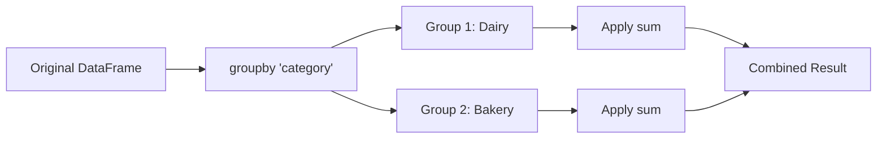
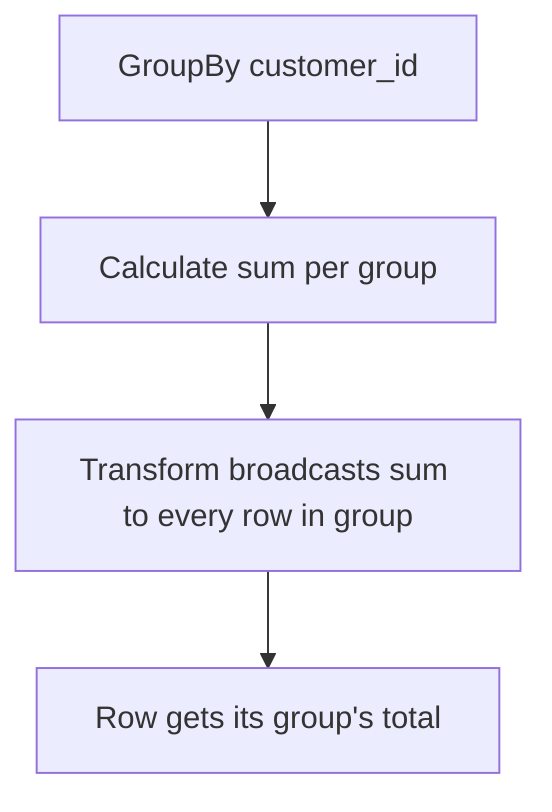

# Day 2 - Python & Pandas (Data Wrangling)

**Objective:** Master pandas for data manipulation, cleaning, and transformation—the skills you'll demonstrate in live coding rounds.

> **All code blocks include detailed inline comments and are followed by a line-by-line plain-English explanation.**

---

## Time Budget

| Block | Duration | Focus |
|-------|----------|-------|
| Morning | 2.5 hours | DataFrame basics + Selection + Filtering |
| Afternoon | 2.5 hours | GroupBy + Merge + Pivot |
| Evening | 2 hours | Apply/Transform + Practice problems + Mock interview |
| **Total** | **7 hours** | |

**Micro-blocks:** 45 min coding → 10 min break → repeat

---

## Topics Covered

1. DataFrame Creation and Inspection
2. Selection: loc, iloc, Boolean indexing
3. Filtering and Conditional Logic
4. GroupBy and Aggregation
5. Merge, Join, Concat
6. Pivot Tables and Reshaping
7. Apply, Map, and Transform
8. Handling Missing Data

---

## Topic 1: DataFrame Creation and Inspection

### Plain-English Explanation
A pandas DataFrame is a 2D table with labeled rows (index) and columns. Think of it as an in-memory spreadsheet or SQL table. Always start by inspecting your data: shape, dtypes, head(), info(), describe().

### Step-by-Step Learning Checklist
- [ ] Create a DataFrame from a dictionary
- [ ] Use `.head()`, `.tail()`, `.shape`, `.columns`
- [ ] Use `.info()` to see dtypes and null counts
- [ ] Use `.describe()` for summary statistics

### What to Say in Interview
> "First thing I do with any dataset is df.info() and df.describe()—this tells me the shape, types, nulls, and distribution in under 10 seconds."

### Common Pitfalls
- **Pitfall:** Assuming column types are correct → **Fix:** Always check `.dtypes`; dates often load as strings
- **Pitfall:** Not checking for duplicates → **Fix:** Run `df.duplicated().sum()` early
- **Pitfall:** Ignoring the index → **Fix:** Reset index if it's meaningless: `df.reset_index(drop=True)`

### Practice Problem 1.1: Create and Inspect a DataFrame

**Problem:** Create a retail transactions DataFrame and perform basic inspection.

```python
# Import pandas - the standard alias is 'pd'
import pandas as pd

# Create a DataFrame from a dictionary
# Each key becomes a column name, each value is a list of row values
transactions = pd.DataFrame({
    'txn_id': [1, 2, 3, 4, 5, 6, 7, 8],           # Transaction identifier
    'customer_id': [101, 102, 101, 103, 102, 101, 104, 103],  # Customer ID
    'product': ['Milk', 'Bread', 'Butter', 'Milk', 'Bagels', 'Bread', 'Milk', 'Butter'],
    'category': ['Dairy', 'Bakery', 'Dairy', 'Dairy', 'Bakery', 'Bakery', 'Dairy', 'Dairy'],
    'quantity': [2, 1, 3, 1, 5, 2, 4, 2],         # Units purchased
    'unit_price': [3.99, 12.50, 2.25, 3.99, 1.50, 12.50, 3.99, 2.25],  # Price per unit
    'txn_date': ['2024-01-15', '2024-01-15', '2024-01-16', '2024-01-16', 
                 '2024-01-17', '2024-01-17', '2024-01-18', '2024-01-18']
})

# Convert txn_date to datetime - CRITICAL for date operations
# pd.to_datetime parses strings into proper datetime objects
transactions['txn_date'] = pd.to_datetime(transactions['txn_date'])

# === INSPECTION COMMANDS ===

# 1. View first 5 rows (default) - quick sanity check
print("=== HEAD ===")
print(transactions.head())

# 2. Shape: (rows, columns) tuple
print(f"\n=== SHAPE ===")
print(f"Rows: {transactions.shape[0]}, Columns: {transactions.shape[1]}")

# 3. Column names as a list
print(f"\n=== COLUMNS ===")
print(transactions.columns.tolist())

# 4. Data types per column - check for type issues
print(f"\n=== DTYPES ===")
print(transactions.dtypes)

# 5. Info: comprehensive summary including non-null counts
print(f"\n=== INFO ===")
transactions.info()

# 6. Describe: statistics for numeric columns only by default
print(f"\n=== DESCRIBE ===")
print(transactions.describe())
```

**Line-by-line Explanation:**

1. `import pandas as pd` — Standard import. Always use the alias `pd`.

2. `pd.DataFrame({...})` — Create a DataFrame from a dictionary. Keys become column names, lists become column values. All lists must have the same length.

3. `pd.to_datetime(...)` — Converts string dates to datetime64 type. Without this, dates are just strings and you can't do date math.

4. `.head()` — Returns first 5 rows. Use `.head(10)` for more. Quick visual sanity check.

5. `.shape` — Returns tuple (n_rows, n_cols). Here it's (8, 7).

6. `.columns.tolist()` — Returns column names as a Python list.

7. `.dtypes` — Shows the data type of each column. Look for: object (usually strings), int64, float64, datetime64.

8. `.info()` — Shows column names, non-null counts, dtypes, and memory usage. Essential for spotting nulls.

9. `.describe()` — Statistics for numeric columns: count, mean, std, min, 25%, 50%, 75%, max.

**Output of head():**

| txn_id | customer_id | product | category | quantity | unit_price | txn_date   |
|--------|-------------|---------|----------|----------|------------|------------|
| 1      | 101         | Milk    | Dairy    | 2        | 3.99       | 2024-01-15 |
| 2      | 102         | Bread   | Bakery   | 1        | 12.50      | 2024-01-15 |
| 3      | 101         | Butter  | Dairy    | 3        | 2.25       | 2024-01-16 |
| 4      | 103         | Milk    | Dairy    | 1        | 3.99       | 2024-01-16 |
| 5      | 102         | Bagels  | Bakery   | 5        | 1.50       | 2024-01-17 |

---

## Topic 2: Selection with loc and iloc

### Plain-English Explanation
- **`loc`**: Label-based selection. Use column names and index labels. Inclusive on both ends.
- **`iloc`**: Integer position-based selection. Use row/column numbers (0-indexed). Exclusive on the end.
- **Boolean indexing**: Pass a True/False series to filter rows.

Memory hook: **loc = Labels, iloc = Integers**

### Step-by-Step Learning Checklist
- [ ] Select a single column using `df['col']` and `df.col`
- [ ] Select multiple columns using `df[['col1', 'col2']]`
- [ ] Select rows by label using `.loc[label]`
- [ ] Select rows by position using `.iloc[position]`
- [ ] Select a specific cell using `.loc[row, col]` and `.iloc[row, col]`

### What to Say in Interview
> "I use loc for label-based selection when I know the column names, and iloc when I need positional access like 'first 10 rows.' Boolean indexing is my go-to for filtering."

### Common Pitfalls
- **Pitfall:** `df.loc[0:5]` includes row 5; `df.iloc[0:5]` excludes row 5 → **Fix:** Remember: loc is inclusive, iloc is exclusive on the end
- **Pitfall:** Using `df.column_name` for columns with spaces → **Fix:** Use `df['column name']` for special characters
- **Pitfall:** Chained indexing `df[df['a']>5]['b']` causing SettingWithCopyWarning → **Fix:** Use `.loc[condition, 'col']`

### Practice Problem 2.1: Selection Techniques

**Problem:** Demonstrate various selection methods on the transactions DataFrame.

```python
import pandas as pd

# Recreate our transactions DataFrame
transactions = pd.DataFrame({
    'txn_id': [1, 2, 3, 4, 5, 6, 7, 8],
    'customer_id': [101, 102, 101, 103, 102, 101, 104, 103],
    'product': ['Milk', 'Bread', 'Butter', 'Milk', 'Bagels', 'Bread', 'Milk', 'Butter'],
    'category': ['Dairy', 'Bakery', 'Dairy', 'Dairy', 'Bakery', 'Bakery', 'Dairy', 'Dairy'],
    'quantity': [2, 1, 3, 1, 5, 2, 4, 2],
    'unit_price': [3.99, 12.50, 2.25, 3.99, 1.50, 12.50, 3.99, 2.25]
})

# === COLUMN SELECTION ===

# Single column - returns a Series (1D)
# Two syntaxes are equivalent for simple column names
product_series = transactions['product']        # Bracket notation (preferred)
product_series_alt = transactions.product       # Dot notation (can't use for spaces/reserved words)
print("Single column (Series):")
print(product_series.head(3))

# Multiple columns - returns a DataFrame (2D)
# Pass a LIST of column names inside the brackets
subset_df = transactions[['product', 'quantity', 'unit_price']]
print("\nMultiple columns (DataFrame):")
print(subset_df.head(3))

# === ROW SELECTION WITH iloc (integer position) ===

# First row (position 0)
first_row = transactions.iloc[0]   # Returns a Series
print("\nFirst row (iloc[0]):")
print(first_row)

# First 3 rows - note: end is EXCLUSIVE (like Python slicing)
first_three = transactions.iloc[0:3]  # Rows at positions 0, 1, 2
print("\nFirst 3 rows (iloc[0:3]):")
print(first_three)

# Last 2 rows using negative indexing
last_two = transactions.iloc[-2:]
print("\nLast 2 rows (iloc[-2:]):")
print(last_two)

# === ROW SELECTION WITH loc (label-based) ===

# If index is default (0,1,2...), loc and iloc seem similar
# But loc uses INDEX LABELS, which happen to be 0,1,2...
# Note: loc is INCLUSIVE on both ends

# Rows with index labels 0 through 2 (inclusive!)
rows_0_to_2 = transactions.loc[0:2]  # Includes row with label 2
print("\nloc[0:2] - includes label 2:")
print(rows_0_to_2)

# === CELL SELECTION ===

# Get a specific cell using iloc[row_pos, col_pos]
cell_iloc = transactions.iloc[0, 2]  # Row 0, Column 2 (product)
print(f"\niloc[0, 2] = {cell_iloc}")

# Get a specific cell using loc[row_label, col_name]
cell_loc = transactions.loc[0, 'product']  # Row with label 0, column 'product'
print(f"loc[0, 'product'] = {cell_loc}")

# === SLICING ROWS AND COLUMNS TOGETHER ===

# iloc: first 3 rows, columns 1 through 3 (positions)
slice_iloc = transactions.iloc[0:3, 1:4]
print("\niloc[0:3, 1:4]:")
print(slice_iloc)

# loc: rows 0-2, specific columns by name
slice_loc = transactions.loc[0:2, ['customer_id', 'product', 'quantity']]
print("\nloc[0:2, ['customer_id', 'product', 'quantity']]:")
print(slice_loc)
```

**Line-by-line Explanation:**

1. `transactions['product']` — Bracket notation to select one column. Returns a Series.

2. `transactions.product` — Dot notation works but fails for column names with spaces or reserved Python words. Prefer brackets.

3. `transactions[['product', 'quantity', 'unit_price']]` — Double brackets = list of columns. Returns a DataFrame.

4. `transactions.iloc[0]` — Get row at integer position 0 (first row). Returns a Series where the index is column names.

5. `transactions.iloc[0:3]` — Slice rows 0, 1, 2. Position 3 is EXCLUDED (Python slice behavior).

6. `transactions.iloc[-2:]` — Negative indexing from the end. Gets last 2 rows.

7. `transactions.loc[0:2]` — Label-based slice. Label 2 is INCLUDED (unlike iloc).

8. `transactions.iloc[0:3, 1:4]` — Row slice AND column slice together. Gets a rectangular subset.

9. `transactions.loc[0:2, ['customer_id', 'product', 'quantity']]` — Row labels 0-2, specific columns by name.

---

## Topic 3: Filtering and Conditional Logic

### Plain-English Explanation
Boolean indexing filters rows where a condition is True. You create a boolean Series using comparison operators, then pass it to `df[...]` or `df.loc[...]`. Combine conditions with `&` (and), `|` (or), and `~` (not). Always wrap each condition in parentheses.

### Step-by-Step Learning Checklist
- [ ] Filter with a single condition
- [ ] Filter with multiple conditions using & and |
- [ ] Use `isin()` for "in list" filtering
- [ ] Use `str.contains()` for text filtering
- [ ] Use `between()` for range filtering

### What to Say in Interview
> "For complex filters, I build boolean masks step by step and combine them. This makes the logic clear and debuggable."

### Common Pitfalls
- **Pitfall:** Using `and`/`or` instead of `&`/`|` → **Fix:** Python's and/or don't work element-wise; use & |
- **Pitfall:** Forgetting parentheses around conditions → **Fix:** `(df['a'] > 5) & (df['b'] < 10)`
- **Pitfall:** Filtering on NaN with `==` → **Fix:** Use `.isna()` or `.notna()`

### Practice Problem 3.1: Complex Filtering

**Problem:** Filter transactions using various conditions.

```python
import pandas as pd

transactions = pd.DataFrame({
    'txn_id': [1, 2, 3, 4, 5, 6, 7, 8],
    'customer_id': [101, 102, 101, 103, 102, 101, 104, 103],
    'product': ['Milk', 'Bread', 'Butter', 'Milk', 'Bagels', 'Bread', 'Milk', 'Butter'],
    'category': ['Dairy', 'Bakery', 'Dairy', 'Dairy', 'Bakery', 'Bakery', 'Dairy', 'Dairy'],
    'quantity': [2, 1, 3, 1, 5, 2, 4, 2],
    'unit_price': [3.99, 12.50, 2.25, 3.99, 1.50, 12.50, 3.99, 2.25]
})

# Add a calculated column for total value
# This creates a new column by element-wise multiplication
transactions['total_value'] = transactions['quantity'] * transactions['unit_price']

# === SINGLE CONDITION FILTER ===

# Filter: quantity > 2
# Step 1: Create boolean mask (Series of True/False)
mask_qty = transactions['quantity'] > 2
print("Boolean mask for quantity > 2:")
print(mask_qty.tolist())  # [False, False, True, False, True, False, True, False]

# Step 2: Use mask to filter DataFrame
high_qty = transactions[mask_qty]
print("\nFiltered - quantity > 2:")
print(high_qty)

# === MULTIPLE CONDITIONS WITH & (AND) ===

# Filter: Dairy products with quantity > 1
# IMPORTANT: Each condition must be in parentheses!
dairy_high_qty = transactions[
    (transactions['category'] == 'Dairy') &  # Condition 1: category is Dairy
    (transactions['quantity'] > 1)            # Condition 2: quantity > 1
]
print("\nDairy products with quantity > 1:")
print(dairy_high_qty)

# === MULTIPLE CONDITIONS WITH | (OR) ===

# Filter: Milk OR Bread products
milk_or_bread = transactions[
    (transactions['product'] == 'Milk') |    # Condition 1
    (transactions['product'] == 'Bread')      # Condition 2
]
print("\nMilk OR Bread products:")
print(milk_or_bread)

# === USING isin() FOR "IN LIST" ===

# Better way to do the above - check if value is in a list
# isin() is cleaner than chaining multiple OR conditions
target_products = ['Milk', 'Bread', 'Bagels']
in_target = transactions[transactions['product'].isin(target_products)]
print(f"\nProducts in {target_products}:")
print(in_target)

# === USING between() FOR RANGE ===

# Filter: unit_price between 2 and 5 (inclusive on both ends)
price_range = transactions[transactions['unit_price'].between(2, 5)]
print("\nUnit price between 2 and 5:")
print(price_range)

# === USING str.contains() FOR TEXT MATCHING ===

# Filter: products containing 'Milk' (case-sensitive by default)
contains_milk = transactions[transactions['product'].str.contains('Milk')]
print("\nProducts containing 'Milk':")
print(contains_milk)

# Case-insensitive search
contains_b_ci = transactions[transactions['product'].str.contains('b', case=False)]
print("\nProducts containing 'b' (case-insensitive):")
print(contains_b_ci)

# === NEGATION WITH ~ ===

# Filter: NOT Dairy products
not_dairy = transactions[~(transactions['category'] == 'Dairy')]
print("\nNot Dairy products:")
print(not_dairy)

# === COMBINING COMPLEX CONDITIONS ===

# Filter: (Dairy AND quantity > 1) OR (Bakery AND unit_price > 5)
complex_filter = transactions[
    ((transactions['category'] == 'Dairy') & (transactions['quantity'] > 1)) |
    ((transactions['category'] == 'Bakery') & (transactions['unit_price'] > 5))
]
print("\nComplex filter result:")
print(complex_filter)
```

**Line-by-line Explanation:**

1. `transactions['quantity'] * transactions['unit_price']` — Element-wise multiplication creates a new Series.

2. `transactions['quantity'] > 2` — Creates a boolean Series: True where condition is met.

3. `transactions[mask_qty]` — Filters to rows where mask is True.

4. `(condition1) & (condition2)` — Element-wise AND. Both must be True. Parentheses required!

5. `(condition1) | (condition2)` — Element-wise OR. Either can be True.

6. `.isin(['Milk', 'Bread', 'Bagels'])` — Returns True if value is in the list. Cleaner than multiple OR.

7. `.between(2, 5)` — Returns True if value is between 2 and 5 (inclusive by default).

8. `.str.contains('Milk')` — String method for partial matching. Use `case=False` for case-insensitive.

9. `~(condition)` — Negation. Flips True to False and vice versa.

---

## Topic 4: GroupBy and Aggregation

### Plain-English Explanation
`groupby()` splits data into groups based on column values, then you apply aggregate functions to each group. It's the pandas equivalent of SQL's GROUP BY. The result is a new DataFrame with one row per group.

Memory hook: **Split → Apply → Combine**

### Step-by-Step Learning Checklist
- [ ] Group by single column and apply one aggregate
- [ ] Group by multiple columns
- [ ] Apply multiple aggregates using `.agg()`
- [ ] Name aggregated columns with `.agg()` dictionary

### What to Say in Interview
> "I use groupby with agg() for flexible aggregation. The agg dictionary lets me apply different functions to different columns and name the outputs clearly."

### Common Pitfalls
- **Pitfall:** Forgetting to call an aggregate after groupby → **Fix:** groupby returns a GroupBy object, not a DataFrame
- **Pitfall:** GroupBy creating MultiIndex → **Fix:** Use `as_index=False` or `.reset_index()`
- **Pitfall:** Losing columns not in groupby or aggregation → **Fix:** That's expected; add them to groupby or aggregate them



*Diagram Caption: GroupBy splits data into groups, applies the function to each group, then combines results.*

### Practice Problem 4.1: GroupBy Aggregations

**Problem:** Calculate various aggregates per customer and per category.

```python
import pandas as pd

transactions = pd.DataFrame({
    'txn_id': [1, 2, 3, 4, 5, 6, 7, 8],
    'customer_id': [101, 102, 101, 103, 102, 101, 104, 103],
    'product': ['Milk', 'Bread', 'Butter', 'Milk', 'Bagels', 'Bread', 'Milk', 'Butter'],
    'category': ['Dairy', 'Bakery', 'Dairy', 'Dairy', 'Bakery', 'Bakery', 'Dairy', 'Dairy'],
    'quantity': [2, 1, 3, 1, 5, 2, 4, 2],
    'unit_price': [3.99, 12.50, 2.25, 3.99, 1.50, 12.50, 3.99, 2.25]
})
transactions['total_value'] = transactions['quantity'] * transactions['unit_price']

# === SIMPLE GROUPBY WITH SINGLE AGGREGATE ===

# Total revenue per customer
# as_index=False keeps customer_id as a column (not index)
revenue_per_customer = transactions.groupby('customer_id', as_index=False)['total_value'].sum()
print("Revenue per customer:")
print(revenue_per_customer)

# === GROUPBY WITH MULTIPLE AGGREGATES ===

# Multiple stats per customer using .agg()
customer_stats = transactions.groupby('customer_id', as_index=False).agg({
    'txn_id': 'count',           # Number of transactions (count non-null)
    'quantity': 'sum',            # Total units purchased
    'total_value': ['sum', 'mean']  # Multiple aggregates for one column
})
print("\nCustomer stats (multiple aggregates):")
print(customer_stats)
# Note: This creates MultiIndex columns - we'll flatten them

# === FLATTENING MULTIINDEX COLUMNS ===

# When using multiple aggregates, columns become tuples
# Flatten by joining the tuple elements
customer_stats.columns = ['_'.join(col).strip('_') for col in customer_stats.columns]
print("\nWith flattened column names:")
print(customer_stats)

# === GROUPBY MULTIPLE COLUMNS ===

# Revenue per category per customer
category_customer = transactions.groupby(
    ['category', 'customer_id'],  # Group by both
    as_index=False
)['total_value'].sum()
print("\nRevenue per category per customer:")
print(category_customer)

# === NAMED AGGREGATION (CLEANER SYNTAX) ===

# Named aggregation - specify column name and function together
# This is the cleanest way to do multiple custom aggregates
customer_summary = transactions.groupby('customer_id', as_index=False).agg(
    num_transactions=('txn_id', 'count'),     # Count of transactions
    total_units=('quantity', 'sum'),          # Sum of quantities
    total_revenue=('total_value', 'sum'),     # Sum of revenue
    avg_transaction=('total_value', 'mean'),  # Average transaction value
    max_single_txn=('total_value', 'max')     # Largest single transaction
)
print("\nCustomer summary (named aggregation):")
print(customer_summary)

# === AGGREGATING ALL NUMERIC COLUMNS ===

# Quick aggregate: apply same function to all numeric columns
category_totals = transactions.groupby('category', as_index=False).sum(numeric_only=True)
print("\nCategory totals (all numeric columns summed):")
print(category_totals)
```

**Line-by-line Explanation:**

1. `.groupby('customer_id', as_index=False)` — Groups rows by customer_id. `as_index=False` keeps the grouped column as a regular column instead of making it the index.

2. `['total_value'].sum()` — Select the column to aggregate, then apply the function.

3. `.agg({...})` — Dictionary aggregation. Keys are column names, values are functions (or lists of functions).

4. `['sum', 'mean']` — Multiple aggregates for one column creates MultiIndex columns.

5. `'_'.join(col).strip('_')` — Flattens MultiIndex columns by joining tuple elements with underscore.

6. `.groupby(['category', 'customer_id'])` — Group by multiple columns (creates groups for each combination).

7. `.agg(name=('column', 'function'))` — Named aggregation syntax. Cleaner output with custom column names.

8. `.sum(numeric_only=True)` — Apply sum to all numeric columns, ignoring non-numeric.

**Output of customer_summary:**

| customer_id | num_transactions | total_units | total_revenue | avg_transaction | max_single_txn |
|-------------|------------------|-------------|---------------|-----------------|----------------|
| 101         | 3                | 7           | 39.73         | 13.24           | 25.00          |
| 102         | 2                | 6           | 20.00         | 10.00           | 12.50          |
| 103         | 2                | 3           | 8.49          | 4.25            | 4.50           |
| 104         | 1                | 4           | 15.96         | 15.96           | 15.96          |

---

## Topic 5: Merge, Join, Concat

### Plain-English Explanation
- **`merge()`**: Combines DataFrames on common columns (like SQL JOIN)
- **`concat()`**: Stacks DataFrames vertically (axis=0) or horizontally (axis=1)
- **`join()`**: Merges on index (less common)

Use `merge` when you have a key column to match on. Use `concat` when combining similar DataFrames.

### Step-by-Step Learning Checklist
- [ ] Perform an inner merge on one column
- [ ] Perform a left merge and handle NaN
- [ ] Merge on multiple columns
- [ ] Concatenate DataFrames vertically
- [ ] Concatenate with `ignore_index=True`

### What to Say in Interview
> "I use merge for relational joins—inner when I need matched records only, left when I need to preserve all records from one side. Concat is for stacking DataFrames with the same structure."

### Common Pitfalls
- **Pitfall:** Key column has different names in each DataFrame → **Fix:** Use `left_on` and `right_on`
- **Pitfall:** Duplicate column names causing `_x` and `_y` suffixes → **Fix:** Use `suffixes=('_left', '_right')` or rename beforehand
- **Pitfall:** Merge multiplying rows (many-to-many) → **Fix:** Check for duplicates in key columns

### Practice Problem 5.1: Merging DataFrames

**Problem:** Merge transactions with product and customer reference tables.

```python
import pandas as pd

# Transactions DataFrame
transactions = pd.DataFrame({
    'txn_id': [1, 2, 3, 4],
    'customer_id': [101, 102, 101, 105],  # Note: 105 doesn't exist in customers
    'product_id': [501, 502, 503, 501],
    'quantity': [2, 1, 3, 1]
})

# Products reference table
products = pd.DataFrame({
    'product_id': [501, 502, 503, 504],   # Note: 504 not in transactions
    'product_name': ['Milk', 'Bread', 'Butter', 'Yogurt'],
    'category': ['Dairy', 'Bakery', 'Dairy', 'Dairy']
})

# Customers reference table
customers = pd.DataFrame({
    'customer_id': [101, 102, 103, 104],  # Note: 103, 104 not in transactions
    'customer_name': ['Alice', 'Bob', 'Charlie', 'Diana'],
    'segment': ['Gold', 'Silver', 'Bronze', 'Gold']
})

# === INNER MERGE ===
# Only keeps rows where key exists in BOTH DataFrames

inner_merged = pd.merge(
    transactions,           # Left DataFrame
    products,               # Right DataFrame
    on='product_id',        # Key column (same name in both)
    how='inner'             # Only matching rows
)
print("INNER MERGE (transactions + products):")
print(inner_merged)
# Note: All 4 transactions matched (products 501, 502, 503 exist)

# === LEFT MERGE ===
# Keeps ALL rows from left, fills NaN where no match on right

left_merged = pd.merge(
    transactions,
    customers,
    on='customer_id',
    how='left'              # Keep all from left (transactions)
)
print("\nLEFT MERGE (transactions + customers):")
print(left_merged)
# Note: customer_id 105 has NaN for customer_name and segment

# === RIGHT MERGE ===
# Keeps ALL rows from right, fills NaN where no match on left

right_merged = pd.merge(
    transactions,
    customers,
    on='customer_id',
    how='right'             # Keep all from right (customers)
)
print("\nRIGHT MERGE (transactions + customers):")
print(right_merged)
# Note: customers 103, 104 appear with NaN for transaction columns

# === OUTER MERGE ===
# Keeps ALL rows from both sides

outer_merged = pd.merge(
    transactions,
    customers,
    on='customer_id',
    how='outer'             # Keep all from both
)
print("\nOUTER MERGE (transactions + customers):")
print(outer_merged)

# === MERGE WITH DIFFERENT KEY NAMES ===
# When key columns have different names in each DataFrame

transactions_v2 = transactions.copy()
transactions_v2 = transactions_v2.rename(columns={'customer_id': 'cust_id'})

diff_key_merge = pd.merge(
    transactions_v2,
    customers,
    left_on='cust_id',       # Key name in left DataFrame
    right_on='customer_id',   # Key name in right DataFrame
    how='left'
)
print("\nMERGE with different key names:")
print(diff_key_merge)
```

**Line-by-line Explanation:**

1. `pd.merge(left, right, on='key', how='inner')` — Merge two DataFrames on a common column. `how` specifies the join type.

2. `how='inner'` — Only rows where key exists in both are kept.

3. `how='left'` — All rows from left are kept; non-matches from right become NaN.

4. `how='right'` — All rows from right are kept; non-matches from left become NaN.

5. `how='outer'` — All rows from both are kept; non-matches on either side become NaN.

6. `left_on='cust_id', right_on='customer_id'` — When key columns have different names, specify both.

### Practice Problem 5.2: Concatenating DataFrames

```python
import pandas as pd

# Two DataFrames with same structure (different time periods)
jan_sales = pd.DataFrame({
    'date': ['2024-01-15', '2024-01-16'],
    'product': ['Milk', 'Bread'],
    'revenue': [100, 150]
})

feb_sales = pd.DataFrame({
    'date': ['2024-02-15', '2024-02-16'],
    'product': ['Milk', 'Eggs'],
    'revenue': [120, 80]
})

# === VERTICAL CONCATENATION ===
# Stack DataFrames on top of each other (axis=0 is default)

combined = pd.concat([jan_sales, feb_sales], ignore_index=True)
print("VERTICAL CONCAT:")
print(combined)
# ignore_index=True resets index to 0,1,2,3

# === WITHOUT ignore_index ===
combined_keep_idx = pd.concat([jan_sales, feb_sales])
print("\nVERTICAL CONCAT (keep index):")
print(combined_keep_idx)
# Index is 0,1,0,1 - original indices preserved

# === HORIZONTAL CONCATENATION ===
# Put DataFrames side by side (axis=1)

metrics = pd.DataFrame({
    'product': ['Milk', 'Bread'],
    'cost': [50, 75]
})

horizontal = pd.concat([jan_sales, metrics], axis=1)
print("\nHORIZONTAL CONCAT:")
print(horizontal)
# Warning: This just glues them together, doesn't align on a key
```

**Line-by-line Explanation:**

1. `pd.concat([df1, df2])` — Concatenate a list of DataFrames vertically (stacks rows).

2. `ignore_index=True` — Reset index to 0, 1, 2, ... instead of keeping original indices.

3. `axis=1` — Concatenate horizontally (side by side). Use with caution—doesn't align rows.

---

## Topic 6: Pivot Tables and Reshaping

### Plain-English Explanation
Pivot tables summarize data by creating a matrix. Rows are one variable, columns are another, and values are aggregated. It's like a 2D group by. Use `pivot_table()` for aggregation, `pivot()` for just reshaping without aggregation.

### Step-by-Step Learning Checklist
- [ ] Create a basic pivot table with one value
- [ ] Add row and column hierarchies
- [ ] Use different aggregate functions
- [ ] Handle missing values with `fill_value`

### What to Say in Interview
> "Pivot tables let me see patterns across two dimensions quickly. For retail, I often pivot by store and product category to spot which stores over/under-index in specific categories."

### Practice Problem 6.1: Pivot Table Analysis

```python
import pandas as pd

transactions = pd.DataFrame({
    'customer_id': [101, 101, 102, 102, 103, 103],
    'category': ['Dairy', 'Bakery', 'Dairy', 'Bakery', 'Dairy', 'Dairy'],
    'store': ['North', 'North', 'South', 'South', 'North', 'South'],
    'revenue': [50, 30, 40, 60, 25, 35]
})

# === BASIC PIVOT TABLE ===
# Rows: category, Columns: store, Values: sum of revenue

pivot_basic = pd.pivot_table(
    transactions,
    values='revenue',          # What to aggregate
    index='category',          # Row dimension
    columns='store',           # Column dimension
    aggfunc='sum'              # Aggregation function
)
print("Basic Pivot - Revenue by Category and Store:")
print(pivot_basic)

# === PIVOT WITH MULTIPLE AGGREGATES ===

pivot_multi = pd.pivot_table(
    transactions,
    values='revenue',
    index='category',
    columns='store',
    aggfunc=['sum', 'mean', 'count']  # Multiple aggregates
)
print("\nPivot with multiple aggregates:")
print(pivot_multi)

# === PIVOT WITH MARGINS (TOTALS) ===

pivot_margins = pd.pivot_table(
    transactions,
    values='revenue',
    index='category',
    columns='store',
    aggfunc='sum',
    margins=True,              # Add row/column totals
    margins_name='Total'       # Name for the totals row/column
)
print("\nPivot with margins (totals):")
print(pivot_margins)

# === HANDLE MISSING VALUES ===

pivot_filled = pd.pivot_table(
    transactions,
    values='revenue',
    index='category',
    columns='store',
    aggfunc='sum',
    fill_value=0               # Replace NaN with 0
)
print("\nPivot with fill_value=0:")
print(pivot_filled)

# === MULTI-INDEX PIVOT ===
# Multiple row dimensions

pivot_multi_idx = pd.pivot_table(
    transactions,
    values='revenue',
    index=['category', 'customer_id'],  # Hierarchical rows
    columns='store',
    aggfunc='sum',
    fill_value=0
)
print("\nMulti-index pivot:")
print(pivot_multi_idx)
```

**Line-by-line Explanation:**

1. `pd.pivot_table(df, values, index, columns, aggfunc)` — Create a pivot table. `index` defines rows, `columns` defines columns.

2. `aggfunc='sum'` — Apply sum aggregation. Can be 'mean', 'count', 'min', 'max', or a list.

3. `margins=True` — Add row and column totals.

4. `fill_value=0` — Replace NaN (missing combinations) with 0.

5. `index=['category', 'customer_id']` — Hierarchical row index (MultiIndex).

**Output of pivot_margins:**

| category | North | South | Total |
|----------|-------|-------|-------|
| Bakery   | 30    | 60    | 90    |
| Dairy    | 75    | 75    | 150   |
| Total    | 105   | 135   | 240   |

---

## Topic 7: Apply, Map, and Transform

### Plain-English Explanation
- **`apply()`**: Apply a function to each row/column of a DataFrame or each element of a Series
- **`map()`**: Element-wise function or dictionary mapping on a Series
- **`transform()`**: Like apply for groupby, but returns same-size output

Use apply for custom logic that vectorized operations can't handle. Prefer vectorized operations when possible (faster).

### Step-by-Step Learning Checklist
- [ ] Use apply with a lambda on a Series
- [ ] Use apply with axis=1 for row-wise operations
- [ ] Use map to replace values using a dictionary
- [ ] Use transform with groupby for group-level values

### What to Say in Interview
> "I use apply for custom logic, but I first check if a vectorized operation exists—it's much faster. Transform is great when I need group statistics broadcast back to each row."

### Practice Problem 7.1: Apply and Transform

```python
import pandas as pd
import numpy as np

transactions = pd.DataFrame({
    'customer_id': [101, 101, 102, 102, 103],
    'category': ['Dairy', 'Bakery', 'Dairy', 'Bakery', 'Dairy'],
    'revenue': [50, 30, 40, 60, 25],
    'quantity': [5, 2, 4, 3, 3]
})

# === APPLY ON A SERIES ===

# Apply a function to each element of revenue
# Lambda: anonymous function for simple operations
transactions['revenue_tier'] = transactions['revenue'].apply(
    lambda x: 'High' if x >= 50 else ('Medium' if x >= 30 else 'Low')
)
print("Revenue with tier (apply on Series):")
print(transactions)

# === APPLY ON DATAFRAME (ROW-WISE) ===

# Apply a function to each ROW (axis=1)
# Row is passed as a Series; access columns by name
def calculate_metrics(row):
    """Calculate custom metrics for each transaction."""
    unit_price = row['revenue'] / row['quantity']  # Calculate unit price
    is_bulk = row['quantity'] >= 4                  # Flag bulk purchases
    return pd.Series({
        'unit_price': round(unit_price, 2),
        'is_bulk': is_bulk
    })

# axis=1 means apply function to each row
new_cols = transactions.apply(calculate_metrics, axis=1)
print("\nNew columns from row-wise apply:")
print(new_cols)

# Add back to original DataFrame
transactions = pd.concat([transactions, new_cols], axis=1)
print("\nDataFrame with new columns:")
print(transactions)

# === MAP FOR VALUE REPLACEMENT ===

# Map uses a dictionary to replace values
category_codes = {
    'Dairy': 'D',
    'Bakery': 'B'
}
transactions['category_code'] = transactions['category'].map(category_codes)
print("\nCategory codes (using map):")
print(transactions[['category', 'category_code']])

# === TRANSFORM WITH GROUPBY ===

# Transform returns a Series with same length as original
# Useful for adding group-level stats to each row

# Calculate customer's total revenue (group stat)
transactions['customer_total'] = transactions.groupby('customer_id')['revenue'].transform('sum')

# Calculate each transaction's percentage of customer total
transactions['pct_of_customer'] = (
    transactions['revenue'] / transactions['customer_total'] * 100
).round(1)

print("\nWith transform (group stats per row):")
print(transactions[['customer_id', 'revenue', 'customer_total', 'pct_of_customer']])
```

**Line-by-line Explanation:**

1. `.apply(lambda x: ...)` — Apply a function to each element. Lambda is shorthand for simple functions.

2. `axis=1` — Apply function to each row (instead of each column). Row is passed as a Series.

3. `pd.Series({...})` — Return multiple values from apply by returning a Series.

4. `.map(dictionary)` — Replace values using a dictionary lookup. Missing keys become NaN.

5. `.transform('sum')` — Apply aggregate to each group, but return a value for each original row (broadcasts the group total).



*Diagram Caption: Transform broadcasts group-level aggregates back to every row in the group.*

---

## Topic 8: Handling Missing Data

### Plain-English Explanation
Missing data appears as `NaN` (Not a Number) in pandas. Handle it by: detecting (`.isna()`, `.notna()`), removing (`.dropna()`), or filling (`.fillna()`). Always understand *why* data is missing before deciding how to handle it.

### Step-by-Step Learning Checklist
- [ ] Detect missing values with `.isna()` and `.isna().sum()`
- [ ] Drop rows with any missing values
- [ ] Drop rows with missing values in specific columns
- [ ] Fill with a constant value
- [ ] Fill with forward/backward fill
- [ ] Fill with group mean

### What to Say in Interview
> "Before filling missing values, I ask: is this missing at random, or is there a pattern? For truly random missing, I might impute with median. For systematic missing, like sensor failures, I might forward-fill or flag it."

### Practice Problem 8.1: Handling Missing Values

```python
import pandas as pd
import numpy as np

# Create DataFrame with missing values
df = pd.DataFrame({
    'customer_id': [101, 102, 103, 104, 105],
    'revenue': [50, np.nan, 30, np.nan, 60],      # Two missing
    'quantity': [5, 3, np.nan, 4, 6],             # One missing
    'category': ['Dairy', None, 'Bakery', 'Dairy', 'Dairy']  # One missing
})

print("Original DataFrame:")
print(df)

# === DETECTING MISSING VALUES ===

# Check each cell: True if NaN
print("\nMissing values (True = missing):")
print(df.isna())

# Count missing per column
print("\nMissing count per column:")
print(df.isna().sum())

# Percentage missing per column
print("\nMissing percentage per column:")
print((df.isna().sum() / len(df) * 100).round(1))

# === DROPPING ROWS WITH MISSING ===

# Drop rows with ANY missing value
df_drop_any = df.dropna()
print("\nAfter dropna (any):")
print(df_drop_any)
# Only rows 0 and 4 remain (101 and 105)

# Drop rows with missing in SPECIFIC columns only
df_drop_subset = df.dropna(subset=['revenue'])
print("\nAfter dropna (subset=['revenue']):")
print(df_drop_subset)
# Rows with missing revenue dropped, others kept

# === FILLING MISSING VALUES ===

# Fill with a constant
df_fill_const = df.copy()
df_fill_const['revenue'] = df_fill_const['revenue'].fillna(0)
print("\nRevenue filled with 0:")
print(df_fill_const['revenue'].tolist())

# Fill with column mean
df_fill_mean = df.copy()
mean_revenue = df_fill_mean['revenue'].mean()  # Mean of non-null values
print(f"\nMean revenue (ignoring NaN): {mean_revenue}")
df_fill_mean['revenue'] = df_fill_mean['revenue'].fillna(mean_revenue)
print("Revenue filled with mean:")
print(df_fill_mean['revenue'].tolist())

# Fill with median (more robust to outliers)
df_fill_median = df.copy()
df_fill_median['revenue'] = df_fill_median['revenue'].fillna(
    df_fill_median['revenue'].median()
)

# === FORWARD AND BACKWARD FILL ===

# Time series data often uses forward fill (last known value)
ts_data = pd.DataFrame({
    'date': pd.date_range('2024-01-01', periods=5),
    'value': [10, np.nan, np.nan, 40, 50]
})
print("\nTime series with missing:")
print(ts_data)

# Forward fill: copy previous value forward
ts_data['ffill'] = ts_data['value'].ffill()

# Backward fill: copy next value backward  
ts_data['bfill'] = ts_data['value'].bfill()

print("\nWith ffill and bfill:")
print(ts_data)

# === FILL WITH GROUP MEAN ===

# Fill missing revenue with category mean
df_group = df.copy()
df_group['revenue'] = df_group.groupby('category')['revenue'].transform(
    lambda x: x.fillna(x.mean())
)
print("\nRevenue filled with category mean:")
print(df_group)
```

**Line-by-line Explanation:**

1. `.isna()` — Returns a DataFrame of booleans (True = missing).

2. `.isna().sum()` — Sum of True values = count of missing per column.

3. `.dropna()` — Remove rows with any NaN. Use `subset` for specific columns.

4. `.fillna(value)` — Replace NaN with a constant.

5. `.fillna(df['col'].mean())` — Fill with the column's mean.

6. `.ffill()` — Forward fill: propagate last valid value forward.

7. `.bfill()` — Backward fill: propagate next valid value backward.

8. `groupby().transform(lambda x: x.fillna(x.mean()))` — Fill with group-specific mean.

---

## Quick Memorization List

1. **loc vs iloc:** loc = Labels (inclusive), iloc = Integers (exclusive end)
2. **Boolean operators:** Use `&` (and), `|` (or), `~` (not) with parentheses around each condition
3. **GroupBy template:** `df.groupby('col', as_index=False).agg(name=('col', 'func'))`
4. **Merge types:** inner (matches only), left (all left), right (all right), outer (all both)
5. **Merge syntax:** `pd.merge(left, right, on='key', how='inner')`
6. **Concat syntax:** `pd.concat([df1, df2], ignore_index=True)`
7. **Transform vs agg:** agg reduces to one row per group; transform returns same-size output
8. **fillna options:** constant, mean/median, ffill, bfill, group-specific
9. **Apply axis:** axis=0 (columns), axis=1 (rows)
10. **map:** Series-only, uses dictionary for value replacement
11. **pivot_table:** `pd.pivot_table(df, values, index, columns, aggfunc)`
12. **Check nulls:** `df.isna().sum()` for counts per column

---

## End-of-Day Mock Interview

### Question 1 (Coding): RFM Calculation
> "Calculate Recency, Frequency, and Monetary for each customer given a transactions DataFrame."

**Model Answer:**
```python
import pandas as pd
from datetime import datetime

# Assume today is 2024-01-20
today = pd.to_datetime('2024-01-20')

rfm = transactions.groupby('customer_id').agg(
    recency=('txn_date', lambda x: (today - x.max()).days),  # Days since last purchase
    frequency=('txn_id', 'nunique'),                          # Count of transactions
    monetary=('total_value', 'sum')                           # Total spend
).reset_index()
```

### Question 2 (Short Answer): Merge vs Concat
> "When would you use merge versus concat?"

**Model Answer:**
"I use merge when I need to combine DataFrames based on matching key columns—it's like a SQL JOIN. I use concat when I have DataFrames with the same structure that I want to stack vertically (like combining monthly data) or horizontally (like adding calculated columns)."

### Question 3 (Coding): Top N per Group
> "Find the top 2 products by revenue for each store."

**Model Answer:**
```python
top_2 = (
    df.groupby(['store', 'product'])['revenue']
    .sum()
    .reset_index()
    .groupby('store', group_keys=False)
    .apply(lambda x: x.nlargest(2, 'revenue'))
    .reset_index(drop=True)
)
```

### Question 4 (Case): Product Sales Dropped
> "How would you use pandas to investigate a 30% drop in a product's sales?"

**Model Answer:**
1. Filter to the product: `df[df['product'] == 'X']`
2. Compare time periods: `groupby(['period']).agg()` to see week-over-week
3. Segment by store: `groupby(['store', 'period'])` to find if drop is localized
4. Check price changes: Look at average unit_price across periods
5. Check inventory: If available, merge with stock data to detect stockouts

### Question 5 (Coding): Fill Missing with Group Mean
> "Fill missing 'price' values with the mean price for that product category."

**Model Answer:**
```python
df['price'] = df.groupby('category')['price'].transform(
    lambda x: x.fillna(x.mean())
)
```

---

## "If You Only Have 60 Minutes" Sprint Plan

| Time | Activity |
|------|----------|
| 0-10 min | Review loc/iloc selection with quick examples |
| 10-25 min | Practice 2 groupby problems (aggregation, named agg) |
| 25-40 min | Do one merge exercise (left join with NaN handling) |
| 40-50 min | Practice fillna with group mean pattern |
| 50-60 min | Review the 12-item memorization list |

---

## 1-Page Cheat Sheet

```
=== PANDAS CHEAT SHEET ===

SELECTION
  df['col']              # Single column → Series
  df[['a', 'b']]         # Multiple columns → DataFrame
  df.loc[row, col]       # Label-based, inclusive
  df.iloc[row, col]      # Integer-based, end exclusive

FILTERING
  df[df['a'] > 5]                 # Single condition
  df[(df['a'] > 5) & (df['b'] < 10)]  # Multiple (use & | ~)
  df[df['a'].isin([1, 2, 3])]     # In list
  df[df['a'].between(5, 10)]      # Range

GROUPBY
  df.groupby('col')['val'].sum()
  df.groupby('col', as_index=False).agg(
      name=('col', 'func')
  )

MERGE
  pd.merge(left, right, on='key', how='inner')
  how: 'inner', 'left', 'right', 'outer'
  left_on/right_on for different key names

CONCAT
  pd.concat([df1, df2], ignore_index=True)  # Vertical
  pd.concat([df1, df2], axis=1)             # Horizontal

PIVOT
  pd.pivot_table(df, values='v', index='r', columns='c', aggfunc='sum')

MISSING DATA
  df.isna().sum()              # Count nulls per column
  df.dropna(subset=['col'])    # Drop rows with null in col
  df['col'].fillna(value)      # Fill with constant
  df['col'].ffill()            # Forward fill
  groupby().transform(lambda x: x.fillna(x.mean()))  # Group fill

APPLY / TRANSFORM
  df['col'].apply(lambda x: ...)     # Element-wise
  df.apply(func, axis=1)              # Row-wise
  df['col'].map({'a': 1, 'b': 2})     # Dictionary mapping
  groupby().transform('sum')          # Broadcast group stat

COMMON PATTERNS
  # Add calculated column
  df['new'] = df['a'] * df['b']
  
  # Top N per group
  df.groupby('g').apply(lambda x: x.nlargest(N, 'val'))
  
  # Percentage of group total
  df['pct'] = df['val'] / df.groupby('g')['val'].transform('sum')
```

---

*Day 2 Complete. These pandas patterns will serve you in every data manipulation task.*
