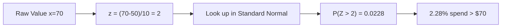
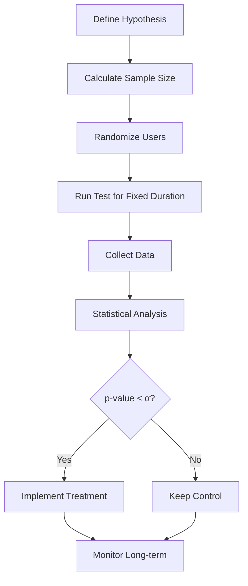

# Day 3 - Statistics & Probability

**Objective:** Master the statistical foundations needed for data science interviews—descriptive stats, probability, distributions, hypothesis testing, and A/B testing concepts.

> **All code blocks include detailed inline comments and are followed by a line-by-line plain-English explanation.**

---

## Time Budget

| Block | Duration | Focus |
|-------|----------|-------|
| Morning | 2.5 hours | Descriptive stats + Probability basics |
| Afternoon | 2.5 hours | Distributions + Hypothesis testing |
| Evening | 2 hours | A/B testing + Practice problems + Mock interview |
| **Total** | **7 hours** | |

**Micro-blocks:** 45 min study → 10 min break → repeat

---

## Topics Covered

1. Descriptive Statistics (Mean, Median, Mode, Variance, Std Dev)
2. Probability Fundamentals (Rules, Conditional, Bayes)
3. Common Distributions (Normal, Binomial, Poisson)
4. Hypothesis Testing (t-test, p-values, significance)
5. A/B Testing Framework
6. Correlation vs Causation

---

## Topic 1: Descriptive Statistics

### Plain-English Explanation
Descriptive statistics summarize data using numbers. **Central tendency** tells you "where's the middle?" (mean, median, mode). **Spread** tells you "how scattered?" (variance, standard deviation, IQR). For retail: average basket size is central tendency; variation in basket size is spread.

Memory hook: **"Central tendency = the typical value. Spread = how typical is typical?"**

### Step-by-Step Learning Checklist
- [ ] Calculate mean, median, mode by hand and with pandas
- [ ] Calculate variance and standard deviation
- [ ] Identify when to use mean vs median (skewed data)
- [ ] Calculate percentiles and IQR

### What to Say in Interview
> "I use median for skewed data like income or transaction values because outliers don't distort it. Mean is better when data is symmetric."

### Common Pitfalls
- **Pitfall:** Using mean on skewed data → **Fix:** Use median; always check distribution shape
- **Pitfall:** Confusing population vs sample formulas → **Fix:** Sample uses n-1 (Bessel's correction)
- **Pitfall:** Ignoring outliers → **Fix:** Check for outliers with IQR method: < Q1-1.5×IQR or > Q3+1.5×IQR

### Formulas to Memorize

| Statistic | Formula | Notes |
|-----------|---------|-------|
| Mean | $\bar{x} = \frac{\sum x_i}{n}$ | Sum divided by count |
| Variance (sample) | $s^2 = \frac{\sum (x_i - \bar{x})^2}{n-1}$ | Average squared deviation |
| Std Dev (sample) | $s = \sqrt{s^2}$ | Square root of variance |
| IQR | $Q3 - Q1$ | Middle 50% spread |

### Practice Problem 1.1: Calculate Descriptive Stats

**Problem:** Given customer transaction values, calculate all descriptive statistics.

**Sample Data:** Transaction values: [25, 30, 35, 40, 45, 50, 150]

```python
import pandas as pd
import numpy as np

# Create a Series of transaction values
# Note: 150 is an outlier - this affects mean vs median comparison
transactions = pd.Series([25, 30, 35, 40, 45, 50, 150])

# === CENTRAL TENDENCY ===

# Mean: sum of all values divided by count
# Mean = (25+30+35+40+45+50+150) / 7 = 375 / 7 = 53.57
mean_val = transactions.mean()
print(f"Mean: {mean_val:.2f}")

# Median: middle value when sorted (here: 40, the 4th of 7 values)
# For even count: average of two middle values
median_val = transactions.median()
print(f"Median: {median_val:.2f}")

# Mode: most frequent value (here: all occur once, so shows first)
# For transaction data, mode is often less useful
mode_val = transactions.mode()
print(f"Mode: {mode_val.values}")

# === SPREAD ===

# Variance (sample): average squared deviation from mean
# Using n-1 (default in pandas) for sample variance
variance_val = transactions.var()  # ddof=1 is default (sample variance)
print(f"Variance (sample): {variance_val:.2f}")

# Population variance uses n instead of n-1
variance_pop = transactions.var(ddof=0)
print(f"Variance (population): {variance_pop:.2f}")

# Standard Deviation: square root of variance
# Interpretation: "typical distance from the mean"
std_val = transactions.std()
print(f"Std Dev (sample): {std_val:.2f}")

# Range: max - min (simple but sensitive to outliers)
range_val = transactions.max() - transactions.min()
print(f"Range: {range_val}")

# === PERCENTILES AND IQR ===

# Percentiles: value below which X% of data falls
q1 = transactions.quantile(0.25)  # 25th percentile
q2 = transactions.quantile(0.50)  # 50th percentile (= median)
q3 = transactions.quantile(0.75)  # 75th percentile
print(f"\nQ1 (25th): {q1}")
print(f"Q2 (50th): {q2}")
print(f"Q3 (75th): {q3}")

# IQR: Interquartile Range = Q3 - Q1
# Measures spread of middle 50% of data
iqr = q3 - q1
print(f"IQR: {iqr}")

# === OUTLIER DETECTION ===

# IQR method: outliers are < Q1 - 1.5*IQR or > Q3 + 1.5*IQR
lower_bound = q1 - 1.5 * iqr
upper_bound = q3 + 1.5 * iqr
print(f"\nOutlier bounds: ({lower_bound:.2f}, {upper_bound:.2f})")

# Identify outliers
outliers = transactions[(transactions < lower_bound) | (transactions > upper_bound)]
print(f"Outliers: {outliers.values}")

# === DESCRIBE() FOR QUICK SUMMARY ===
print("\n=== describe() output ===")
print(transactions.describe())
```

**Line-by-line Explanation:**

1. `pd.Series([25, 30, ...])` — Create a 1D array with index. Series is the building block of DataFrames.

2. `transactions.mean()` — Calculates arithmetic mean: sum(375) / count(7) = 53.57. Notice the outlier (150) pulls the mean up.

3. `transactions.median()` — Sorts values and returns the middle one. Here: 25, 30, 35, **40**, 45, 50, 150. Median = 40.

4. `transactions.var()` — Sample variance using n-1 denominator. Each value's squared distance from mean, averaged.

5. `transactions.var(ddof=0)` — Population variance using n denominator. `ddof` = degrees of freedom to subtract.

6. `transactions.quantile(0.25)` — Returns the value where 25% of data is below. "Q1" in boxplot terms.

7. `q3 - q1` — IQR captures the middle 50% spread, robust to outliers.

8. `lower_bound = q1 - 1.5 * iqr` — Standard outlier detection. Values beyond these bounds are flagged.

**Key Insight:** Mean (53.57) vs Median (40) shows the outlier's effect. In interviews, always mention checking for skewness when asked about averages.

### Practice Problem 1.2: Coefficient of Variation

**Problem:** Compare variability between two products with different price scales.

```python
import pandas as pd

# Two products with different price scales
product_a = pd.Series([10, 12, 11, 13, 9])      # Low-priced: mean ~11
product_b = pd.Series([100, 120, 110, 130, 90]) # High-priced: mean ~110

# Standard deviation alone is misleading for comparison
std_a = product_a.std()
std_b = product_b.std()
print(f"Product A Std Dev: {std_a:.2f}")
print(f"Product B Std Dev: {std_b:.2f}")
# B has higher std, but is it more "variable" relative to its scale?

# Coefficient of Variation (CV) = std / mean
# Expressed as percentage - allows comparing different scales
cv_a = (product_a.std() / product_a.mean()) * 100
cv_b = (product_b.std() / product_b.mean()) * 100
print(f"\nProduct A CV: {cv_a:.2f}%")
print(f"Product B CV: {cv_b:.2f}%")
# Same CV (14.49%) - both have same RELATIVE variability
```

**Explanation:** Coefficient of Variation normalizes standard deviation by the mean, allowing comparison across different scales. Both products have ~14.5% CV, meaning their relative variability is identical despite Product B having 10x higher absolute std dev.

---

## Topic 2: Probability Fundamentals

### Plain-English Explanation
Probability quantifies uncertainty. **Basic probability** = favorable outcomes / total outcomes. **Conditional probability** asks "what's the probability of A given B already happened?" **Bayes' theorem** flips conditional probabilities—crucial for updating beliefs with new data.

Memory hook: **"P(A|B) = probability of A after we know B happened"**

### Step-by-Step Learning Checklist
- [ ] Calculate simple probabilities from data
- [ ] Apply the addition rule (P(A or B))
- [ ] Apply the multiplication rule (P(A and B))
- [ ] Calculate conditional probabilities
- [ ] Apply Bayes' theorem

### What to Say in Interview
> "Bayes' theorem lets me update my probability estimate when I learn new information. For example, if a customer converts, I update my belief about which marketing channel influenced them."

### Common Pitfalls
- **Pitfall:** Adding probabilities when events overlap → **Fix:** Use P(A or B) = P(A) + P(B) - P(A and B)
- **Pitfall:** Assuming independence when events are related → **Fix:** Check if P(A|B) = P(A)
- **Pitfall:** Confusing P(A|B) with P(B|A) → **Fix:** These are different! Use Bayes to flip

### Key Formulas

| Rule | Formula | When to Use |
|------|---------|-------------|
| Addition (mutually exclusive) | P(A or B) = P(A) + P(B) | Events can't both happen |
| Addition (general) | P(A or B) = P(A) + P(B) - P(A and B) | Events can overlap |
| Multiplication (independent) | P(A and B) = P(A) × P(B) | Events don't affect each other |
| Multiplication (dependent) | P(A and B) = P(A) × P(B\|A) | Events are related |
| Conditional | P(A\|B) = P(A and B) / P(B) | Probability after knowing B |
| Bayes | P(A\|B) = P(B\|A) × P(A) / P(B) | Flip conditional probabilities |

### Practice Problem 2.1: Customer Segmentation Probability

**Problem:** Given customer data, calculate various probabilities.

**Sample Data:**
| Segment | Churn | No Churn | Total |
|---------|-------|----------|-------|
| Gold | 10 | 90 | 100 |
| Silver | 30 | 70 | 100 |
| Bronze | 50 | 50 | 100 |
| Total | 90 | 210 | 300 |

```python
import pandas as pd

# Create contingency table
data = {
    'Segment': ['Gold', 'Silver', 'Bronze'],
    'Churn': [10, 30, 50],
    'No_Churn': [90, 70, 50]
}
df = pd.DataFrame(data)
df['Total'] = df['Churn'] + df['No_Churn']

# Grand totals
total_customers = df['Total'].sum()  # 300
total_churn = df['Churn'].sum()       # 90
total_no_churn = df['No_Churn'].sum() # 210

print("=== SIMPLE PROBABILITIES ===")

# P(Churn) = customers who churned / total customers
# P(Churn) = 90 / 300 = 0.30
p_churn = total_churn / total_customers
print(f"P(Churn) = {total_churn}/{total_customers} = {p_churn:.3f}")

# P(Gold) = Gold customers / total customers
# P(Gold) = 100 / 300 = 0.333
gold_total = df[df['Segment'] == 'Gold']['Total'].values[0]
p_gold = gold_total / total_customers
print(f"P(Gold) = {gold_total}/{total_customers} = {p_gold:.3f}")

print("\n=== CONDITIONAL PROBABILITIES ===")

# P(Churn | Gold) = P(Churn AND Gold) / P(Gold)
# = (Gold customers who churned) / (all Gold customers)
# = 10 / 100 = 0.10
gold_churn = df[df['Segment'] == 'Gold']['Churn'].values[0]
p_churn_given_gold = gold_churn / gold_total
print(f"P(Churn | Gold) = {gold_churn}/{gold_total} = {p_churn_given_gold:.3f}")

# P(Churn | Bronze) = 50 / 100 = 0.50
bronze_total = df[df['Segment'] == 'Bronze']['Total'].values[0]
bronze_churn = df[df['Segment'] == 'Bronze']['Churn'].values[0]
p_churn_given_bronze = bronze_churn / bronze_total
print(f"P(Churn | Bronze) = {bronze_churn}/{bronze_total} = {p_churn_given_bronze:.3f}")

print("\n=== BAYES' THEOREM ===")
# P(Gold | Churn) = P(Churn | Gold) × P(Gold) / P(Churn)
# Given someone churned, what's probability they were Gold?

# Step-by-step calculation:
# P(Churn | Gold) = 0.10 (calculated above)
# P(Gold) = 0.333 (calculated above)
# P(Churn) = 0.30 (calculated above)

p_gold_given_churn = (p_churn_given_gold * p_gold) / p_churn
print(f"P(Gold | Churn) = ({p_churn_given_gold:.3f} × {p_gold:.3f}) / {p_churn:.3f}")
print(f"                = {p_gold_given_churn:.4f}")
# = (0.10 × 0.333) / 0.30 = 0.0333 / 0.30 = 0.111

# Verify: Among 90 churned customers, 10 are Gold = 10/90 = 0.111 ✓
print(f"Verification: {gold_churn}/{total_churn} = {gold_churn/total_churn:.4f}")
```

**Line-by-line Explanation:**

1. `p_churn = 90 / 300` — Simple probability: fraction of all customers who churned.

2. `p_churn_given_gold = 10 / 100` — Conditional probability: among ONLY Gold customers, what fraction churned?

3. **Bayes' Theorem calculation:**
   - We know P(Churn|Gold) = 0.10
   - We want P(Gold|Churn) = ?
   - Bayes: P(Gold|Churn) = P(Churn|Gold) × P(Gold) / P(Churn)
   - = (0.10 × 0.333) / 0.30 = 0.111

**Key Insight:** Only 11.1% of churned customers are Gold, despite Gold being 33.3% of all customers. This is because Gold customers have a low churn rate (10% vs 30% overall).

### Practice Problem 2.2: Independence Check

**Problem:** Determine if segment and churn are independent.

```python
# Two events are INDEPENDENT if P(A|B) = P(A)
# i.e., knowing B doesn't change the probability of A

# Check: Is P(Churn | Gold) = P(Churn)?
p_churn = 0.30
p_churn_given_gold = 0.10

print("Independence Check:")
print(f"P(Churn) = {p_churn}")
print(f"P(Churn | Gold) = {p_churn_given_gold}")

if abs(p_churn - p_churn_given_gold) < 0.01:
    print("Segment and Churn are INDEPENDENT")
else:
    print("Segment and Churn are DEPENDENT")
    print(f"Difference: {abs(p_churn - p_churn_given_gold):.2f}")
```

**Explanation:** Since P(Churn|Gold) = 0.10 ≠ P(Churn) = 0.30, segment and churn are dependent. Knowing someone is Gold DOES change our estimate of their churn probability.

---

## Topic 3: Common Distributions

### Plain-English Explanation
A distribution describes how probable each possible value is. **Normal distribution** (bell curve) appears everywhere due to Central Limit Theorem. **Binomial** counts successes in fixed trials (e.g., 5 customers, how many convert?). **Poisson** counts events in fixed time/space (e.g., customers arriving per hour).

Memory hook:
- **Normal:** Continuous, symmetric, mean=median=mode
- **Binomial:** n trials, yes/no outcome, count successes
- **Poisson:** Count events in interval, rare events

### Step-by-Step Learning Checklist
- [ ] Generate and visualize a normal distribution
- [ ] Calculate probabilities from normal distribution
- [ ] Use z-scores to standardize values
- [ ] Calculate binomial probabilities
- [ ] Recognize when to use Poisson

### What to Say in Interview
> "I use the normal distribution when data is the result of many small independent factors—like customer lifetime value. Binomial is for counting yes/no outcomes in fixed trials, like conversion rates."

### Common Pitfalls
- **Pitfall:** Assuming all data is normal → **Fix:** Always check with histogram or Q-Q plot
- **Pitfall:** Using wrong distribution for count data → **Fix:** Counts are often Poisson or Negative Binomial
- **Pitfall:** Forgetting z-score direction → **Fix:** z = (x - mean) / std. Positive z = above mean

### Key Python Functions

```python
from scipy import stats

# Normal: stats.norm.pdf(), stats.norm.cdf(), stats.norm.ppf()
# Binomial: stats.binom.pmf(), stats.binom.cdf()
# Poisson: stats.poisson.pmf(), stats.poisson.cdf()
```

### Practice Problem 3.1: Normal Distribution

**Problem:** Customer spend follows a normal distribution with mean=$50, std=$10. Calculate various probabilities.

```python
import numpy as np
from scipy import stats

# Define the distribution parameters
mean = 50   # Average customer spend
std = 10    # Standard deviation

# Create the distribution object
# This represents: X ~ Normal(mean=50, std=10)
normal_dist = stats.norm(loc=mean, scale=std)

print("=== PROBABILITY CALCULATIONS ===\n")

# Question 1: What's the probability a customer spends less than $40?
# P(X < 40) = ?
prob_less_40 = normal_dist.cdf(40)  # CDF gives P(X <= value)
print(f"P(X < 40) = {prob_less_40:.4f}")
print(f"Interpretation: {prob_less_40*100:.2f}% of customers spend less than $40\n")

# Question 2: What's the probability a customer spends more than $70?
# P(X > 70) = 1 - P(X <= 70)
prob_more_70 = 1 - normal_dist.cdf(70)
print(f"P(X > 70) = 1 - P(X <= 70) = {prob_more_70:.4f}")
print(f"Interpretation: {prob_more_70*100:.2f}% of customers spend more than $70\n")

# Question 3: What's the probability a customer spends between $45 and $65?
# P(45 < X < 65) = P(X < 65) - P(X < 45)
prob_45_to_65 = normal_dist.cdf(65) - normal_dist.cdf(45)
print(f"P(45 < X < 65) = P(X<65) - P(X<45)")
print(f"             = {normal_dist.cdf(65):.4f} - {normal_dist.cdf(45):.4f}")
print(f"             = {prob_45_to_65:.4f}\n")

print("=== Z-SCORE CALCULATIONS ===\n")

# Z-score: How many standard deviations from the mean?
# Formula: z = (x - mean) / std
x = 70
z = (x - mean) / std
print(f"Z-score for x=${x}:")
print(f"z = ({x} - {mean}) / {std} = {z}")
print(f"Interpretation: ${x} is {z} standard deviations above the mean\n")

# Use z-score to find probability (should match prob_more_70)
standard_normal = stats.norm(0, 1)  # Standard normal: mean=0, std=1
prob_from_z = 1 - standard_normal.cdf(z)
print(f"P(Z > {z}) = {prob_from_z:.4f} (matches P(X > 70))\n")

print("=== PERCENTILE CALCULATIONS (INVERSE) ===\n")

# What spend value is at the 90th percentile?
# i.e., what value x such that P(X <= x) = 0.90?
percentile_90 = normal_dist.ppf(0.90)  # ppf = percent point function (inverse of cdf)
print(f"90th percentile: ${percentile_90:.2f}")
print(f"Interpretation: 90% of customers spend less than ${percentile_90:.2f}")

# What spend value is at the 10th percentile?
percentile_10 = normal_dist.ppf(0.10)
print(f"10th percentile: ${percentile_10:.2f}")
```

**Line-by-line Explanation:**

1. `stats.norm(loc=50, scale=10)` — Create a normal distribution object. `loc`=mean, `scale`=std.

2. `.cdf(40)` — Cumulative Distribution Function. Returns P(X ≤ 40). Think: "what fraction is to the LEFT of 40?"

3. `1 - normal_dist.cdf(70)` — P(X > 70) = complement of P(X ≤ 70).

4. `.cdf(65) - .cdf(45)` — P(45 < X < 65). Subtract the CDF values to get "area between."

5. `z = (x - mean) / std` — Z-score standardizes any normal to standard normal (mean=0, std=1).

6. `.ppf(0.90)` — Percent Point Function (inverse of CDF). Given a probability, what's the value?



*Diagram Caption: Converting raw values to z-scores for probability lookup.*

### Practice Problem 3.2: Binomial Distribution

**Problem:** A store has a 20% conversion rate. If 10 customers enter, what's the probability exactly 3 convert?

```python
from scipy import stats

# Binomial parameters
n = 10      # Number of trials (customers)
p = 0.20    # Probability of success (conversion rate)

# Create binomial distribution
binom_dist = stats.binom(n=n, p=p)

# P(X = 3) - probability of EXACTLY 3 conversions
# Using PMF (Probability Mass Function) for discrete distributions
prob_exactly_3 = binom_dist.pmf(3)
print(f"P(X = 3) = {prob_exactly_3:.4f}")
print(f"There's a {prob_exactly_3*100:.1f}% chance exactly 3 of 10 customers convert\n")

# P(X <= 2) - probability of 2 or fewer conversions
prob_at_most_2 = binom_dist.cdf(2)
print(f"P(X <= 2) = {prob_at_most_2:.4f}")

# P(X >= 4) - probability of 4 or more conversions
prob_at_least_4 = 1 - binom_dist.cdf(3)  # 1 - P(X <= 3)
print(f"P(X >= 4) = {prob_at_least_4:.4f}")

# Expected value and standard deviation
expected = n * p
std = (n * p * (1-p)) ** 0.5
print(f"\nExpected conversions: E[X] = n*p = {n}*{p} = {expected}")
print(f"Standard deviation: sqrt(n*p*(1-p)) = {std:.2f}")

# Manual calculation of P(X = 3) using formula
# P(X=k) = C(n,k) * p^k * (1-p)^(n-k)
from math import comb
k = 3
manual_prob = comb(n, k) * (p ** k) * ((1-p) ** (n-k))
print(f"\nManual: C({n},{k}) * {p}^{k} * {1-p}^{n-k}")
print(f"      = {comb(n,k)} * {p**k:.6f} * {(1-p)**(n-k):.6f}")
print(f"      = {manual_prob:.4f}")
```

**Line-by-line Explanation:**

1. `stats.binom(n=10, p=0.20)` — Binomial distribution: 10 trials, 20% success probability each.

2. `.pmf(3)` — Probability Mass Function. For discrete distributions, gives P(X = exact value).

3. `.cdf(2)` — Cumulative: P(X ≤ 2) = P(0) + P(1) + P(2).

4. `1 - binom.cdf(3)` — "At least 4" = complement of "at most 3".

5. `E[X] = n × p` — Expected value of binomial. Here: 10 × 0.20 = 2 expected conversions.

6. `comb(n, k)` — "n choose k" = number of ways to choose k successes from n trials.

---

## Topic 4: Hypothesis Testing

### Plain-English Explanation
Hypothesis testing is a framework for making decisions from data. You start with a **null hypothesis** (H₀: no effect) and an **alternative** (H₁: there IS an effect). You calculate a **p-value**—the probability of seeing your data if H₀ is true. If p-value < α (typically 0.05), you reject H₀.

Memory hook: **"p-value = probability of this extreme a result if nothing is happening"**

### Step-by-Step Learning Checklist
- [ ] State null and alternative hypotheses
- [ ] Calculate a t-statistic
- [ ] Interpret p-values correctly
- [ ] Understand Type I and Type II errors
- [ ] Know when to use one-tailed vs two-tailed tests

### What to Say in Interview
> "I use α=0.05 as a standard, but adjust based on context. For medical decisions where false positives are costly, I'd use α=0.01. The p-value tells me HOW surprising my data is under the null."

### Common Pitfalls
- **Pitfall:** Saying "p-value = probability hypothesis is true" → **Fix:** It's P(data | H₀), not P(H₀ | data)
- **Pitfall:** Ignoring effect size → **Fix:** Statistical significance ≠ practical significance
- **Pitfall:** Multiple testing without correction → **Fix:** Use Bonferroni or FDR correction

### Key Concepts

| Term | Meaning |
|------|---------|
| H₀ (Null) | No effect, no difference, status quo |
| H₁ (Alternative) | There IS an effect or difference |
| α (alpha) | Significance level (typically 0.05) |
| p-value | P(data this extreme \| H₀ is true) |
| Type I Error | False positive (reject H₀ when it's true) |
| Type II Error | False negative (fail to reject H₀ when H₁ true) |
| Power | 1 - P(Type II Error) = ability to detect effect |

### Practice Problem 4.1: One-Sample t-test

**Problem:** A store claims average transaction value is $50. A sample of 30 transactions has mean $53 and std $12. Is this significantly different from $50?

```python
import numpy as np
from scipy import stats

# Sample data (simulated with seed for reproducibility)
np.random.seed(42)
sample = np.random.normal(loc=53, scale=12, size=30)

# Actual sample statistics
sample_mean = sample.mean()
sample_std = sample.std(ddof=1)  # Sample std (n-1)
n = len(sample)
hypothesized_mean = 50  # The claimed value (null hypothesis)

print("=== SAMPLE STATISTICS ===")
print(f"Sample size: n = {n}")
print(f"Sample mean: x̄ = {sample_mean:.2f}")
print(f"Sample std: s = {sample_std:.2f}")
print(f"Hypothesized mean (H₀): μ₀ = {hypothesized_mean}")

print("\n=== HYPOTHESIS SETUP ===")
print("H₀: μ = 50 (average transaction is $50)")
print("H₁: μ ≠ 50 (average transaction is NOT $50)")
print("This is a TWO-TAILED test (we care about any difference)")
print("α = 0.05")

# === METHOD 1: Manual calculation ===
print("\n=== MANUAL CALCULATION ===")

# t-statistic formula: t = (x̄ - μ₀) / (s / √n)
# This measures: how far is sample mean from hypothesized mean,
# in units of standard error
standard_error = sample_std / np.sqrt(n)
t_stat = (sample_mean - hypothesized_mean) / standard_error

print(f"Standard Error: SE = s/√n = {sample_std:.2f}/√{n} = {standard_error:.4f}")
print(f"t-statistic: t = (x̄ - μ₀)/SE = ({sample_mean:.2f} - {hypothesized_mean})/{standard_error:.4f}")
print(f"           t = {t_stat:.4f}")

# Degrees of freedom for one-sample t-test
df = n - 1
print(f"Degrees of freedom: df = n-1 = {df}")

# p-value: probability of t-stat this extreme (two-tailed)
# Multiply by 2 because we're testing "different from" not "greater than"
p_value_manual = 2 * (1 - stats.t.cdf(abs(t_stat), df))
print(f"p-value (two-tailed): {p_value_manual:.4f}")

# === METHOD 2: Using scipy.stats ===
print("\n=== SCIPY ONE-SAMPLE T-TEST ===")
t_stat_scipy, p_value_scipy = stats.ttest_1samp(sample, hypothesized_mean)
print(f"t-statistic: {t_stat_scipy:.4f}")
print(f"p-value: {p_value_scipy:.4f}")

# === INTERPRETATION ===
print("\n=== INTERPRETATION ===")
alpha = 0.05
if p_value_scipy < alpha:
    print(f"p-value ({p_value_scipy:.4f}) < α ({alpha})")
    print("→ REJECT H₀")
    print("Conclusion: The average transaction IS significantly different from $50")
else:
    print(f"p-value ({p_value_scipy:.4f}) >= α ({alpha})")
    print("→ FAIL TO REJECT H₀")
    print("Conclusion: Not enough evidence that average differs from $50")

# === CONFIDENCE INTERVAL ===
print("\n=== 95% CONFIDENCE INTERVAL ===")
# CI = x̄ ± t_critical * SE
t_critical = stats.t.ppf(0.975, df)  # 97.5% for two-tailed 95% CI
margin_of_error = t_critical * standard_error
ci_lower = sample_mean - margin_of_error
ci_upper = sample_mean + margin_of_error
print(f"t-critical (α/2=0.025, df={df}): {t_critical:.4f}")
print(f"Margin of error: {margin_of_error:.2f}")
print(f"95% CI: ({ci_lower:.2f}, {ci_upper:.2f})")
print(f"If CI doesn't contain {hypothesized_mean}, we reject H₀")
```

**Line-by-line Explanation:**

1. `t = (x̄ - μ₀) / (s / √n)` — t-statistic measures how many standard errors the sample mean is from the hypothesized mean.

2. `df = n - 1` — Degrees of freedom. For one-sample t-test, it's sample size minus 1.

3. `2 * (1 - stats.t.cdf(abs(t_stat), df))` — Two-tailed p-value. We multiply by 2 because we care about EITHER direction.

4. `stats.ttest_1samp(sample, 50)` — scipy's built-in one-sample t-test. Returns t-statistic and p-value.

5. **Decision rule:** If p-value < α, reject H₀. Otherwise, fail to reject.

6. `stats.t.ppf(0.975, df)` — Critical t-value for 95% confidence interval (leaving 2.5% in each tail).

### Practice Problem 4.2: Two-Sample t-test

**Problem:** Compare conversion rates between Control (mean=0.18) and Treatment (mean=0.22). Is the difference significant?

```python
import numpy as np
from scipy import stats

# Simulate conversion data (0/1 outcomes)
np.random.seed(42)

# Control group: 500 customers, 18% conversion rate
control = np.random.binomial(1, 0.18, 500)

# Treatment group: 500 customers, 22% conversion rate  
treatment = np.random.binomial(1, 0.22, 500)

print("=== SAMPLE STATISTICS ===")
print(f"Control: n={len(control)}, mean={control.mean():.4f}, std={control.std():.4f}")
print(f"Treatment: n={len(treatment)}, mean={treatment.mean():.4f}, std={treatment.std():.4f}")
print(f"Observed difference: {treatment.mean() - control.mean():.4f}")

print("\n=== HYPOTHESIS ===")
print("H₀: μ_treatment = μ_control (no difference)")
print("H₁: μ_treatment ≠ μ_control (there IS a difference)")

# Two-sample t-test (assuming unequal variances - Welch's t-test)
# This is more robust than assuming equal variances
t_stat, p_value = stats.ttest_ind(treatment, control, equal_var=False)

print("\n=== RESULTS (WELCH'S T-TEST) ===")
print(f"t-statistic: {t_stat:.4f}")
print(f"p-value: {p_value:.4f}")

alpha = 0.05
if p_value < alpha:
    print(f"\nReject H₀ (p={p_value:.4f} < α={alpha})")
    print("The treatment has a significantly different conversion rate")
else:
    print(f"\nFail to reject H₀ (p={p_value:.4f} >= α={alpha})")
    print("No significant difference detected")

# === EFFECT SIZE: Cohen's d ===
# Measures PRACTICAL significance (how big is the difference?)
pooled_std = np.sqrt((control.std()**2 + treatment.std()**2) / 2)
cohens_d = (treatment.mean() - control.mean()) / pooled_std
print(f"\n=== EFFECT SIZE ===")
print(f"Cohen's d: {cohens_d:.4f}")
print("Interpretation: |d| < 0.2 = small, 0.2-0.8 = medium, > 0.8 = large")
```

**Key Insight:** A low p-value means statistically significant, but always check Cohen's d for practical significance. A tiny difference can be "statistically significant" with large sample sizes.

---

## Topic 5: A/B Testing Framework

### Plain-English Explanation
A/B testing compares two versions (A=Control, B=Treatment) to determine which performs better. You need to: (1) decide your metric, (2) calculate required sample size, (3) run the test, (4) analyze results. Key challenge: don't peek too early or you'll get false positives.

Memory hook: **"A/B testing = hypothesis testing with business context"**

### Step-by-Step Learning Checklist
- [ ] Define primary metric and hypothesis
- [ ] Calculate minimum sample size for desired power
- [ ] Understand concepts: MDE, power, significance
- [ ] Correctly interpret A/B test results

### What to Say in Interview
> "Before running an A/B test, I calculate the required sample size based on baseline conversion, minimum detectable effect, and desired power. I use 80% power and 5% significance as standards, but adjust based on business risk tolerance."

### Common Pitfalls
- **Pitfall:** Stopping test early when seeing "significant" result → **Fix:** Pre-commit to sample size
- **Pitfall:** Ignoring multiple comparisons → **Fix:** Correct for testing multiple metrics
- **Pitfall:** Not accounting for novelty effect → **Fix:** Run test long enough for effect to stabilize

### Key Metrics

| Metric | Definition |
|--------|------------|
| Baseline Rate | Current conversion/metric rate (Control) |
| MDE | Minimum Detectable Effect - smallest difference you want to detect |
| Power | Probability of detecting an effect if it exists (typically 80%) |
| Significance (α) | False positive rate (typically 5%) |

### Practice Problem 5.1: Sample Size Calculation

**Problem:** Current conversion is 10%. You want to detect a 2% absolute increase (to 12%). How many users per variant?

```python
import numpy as np
from scipy import stats

def sample_size_proportion(p1, p2, alpha=0.05, power=0.80):
    """
    Calculate required sample size per group for proportion test.
    
    Parameters:
    - p1: Control proportion (baseline)
    - p2: Treatment proportion (expected with effect)
    - alpha: Significance level (Type I error rate)
    - power: Statistical power (1 - Type II error rate)
    
    Returns: Sample size needed per group
    """
    # Z-scores for significance and power
    # alpha/2 because it's two-tailed test
    z_alpha = stats.norm.ppf(1 - alpha/2)  # e.g., 1.96 for α=0.05
    z_beta = stats.norm.ppf(power)          # e.g., 0.84 for power=0.80
    
    print(f"Z for α/2={alpha/2}: {z_alpha:.4f}")
    print(f"Z for power={power}: {z_beta:.4f}")
    
    # Pooled proportion (under null hypothesis)
    p_pooled = (p1 + p2) / 2
    
    # Effect size
    effect = abs(p2 - p1)
    print(f"Effect size: {effect:.4f} ({effect*100:.1f}%)")
    
    # Sample size formula for two proportions
    # n = 2 * ((z_α + z_β)² * p_pooled * (1-p_pooled)) / effect²
    numerator = 2 * ((z_alpha + z_beta) ** 2) * p_pooled * (1 - p_pooled)
    denominator = effect ** 2
    n = numerator / denominator
    
    return int(np.ceil(n))

# Parameters
baseline = 0.10      # Current conversion rate (10%)
target = 0.12        # Target conversion rate (12%)
alpha = 0.05         # 5% significance level
power = 0.80         # 80% power

print("=== A/B TEST SAMPLE SIZE CALCULATION ===\n")
print(f"Baseline conversion: {baseline*100:.1f}%")
print(f"Target conversion: {target*100:.1f}%")
print(f"Minimum Detectable Effect: {(target-baseline)*100:.1f}%")
print(f"Significance level (α): {alpha}")
print(f"Power: {power}\n")

n_per_group = sample_size_proportion(baseline, target, alpha, power)

print(f"\n=== RESULT ===")
print(f"Sample size needed: {n_per_group:,} per group")
print(f"Total sample size: {2*n_per_group:,} (both groups combined)")

# Sensitivity analysis: what if we want 90% power?
n_high_power = sample_size_proportion(baseline, target, alpha, power=0.90)
print(f"\nWith 90% power: {n_high_power:,} per group")
```

**Line-by-line Explanation:**

1. `z_alpha = stats.norm.ppf(1 - alpha/2)` — Z-value for significance. For α=0.05 two-tailed, we use 0.975 quantile = 1.96.

2. `z_beta = stats.norm.ppf(power)` — Z-value for power. For 80% power, = 0.84.

3. `effect = abs(p2 - p1)` — The difference we want to detect (MDE = 2 percentage points).

4. The formula combines significance, power, baseline variance, and effect size to determine required n.

### Practice Problem 5.2: A/B Test Analysis

**Problem:** After running the test, Control had 8% conversion (400/5000) and Treatment had 10% (500/5000). Is this significant?

```python
import numpy as np
from scipy import stats

# Test results
n_control = 5000
conversions_control = 400
p_control = conversions_control / n_control

n_treatment = 5000
conversions_treatment = 500
p_treatment = conversions_treatment / n_treatment

print("=== A/B TEST RESULTS ===\n")
print(f"Control: {conversions_control}/{n_control} = {p_control*100:.2f}%")
print(f"Treatment: {conversions_treatment}/{n_treatment} = {p_treatment*100:.2f}%")
print(f"Observed lift: {((p_treatment/p_control)-1)*100:.2f}%")
print(f"Absolute difference: {(p_treatment-p_control)*100:.2f} percentage points")

# === TWO-PROPORTION Z-TEST ===

# Pooled proportion (under H₀ that both are equal)
p_pooled = (conversions_control + conversions_treatment) / (n_control + n_treatment)

# Standard error of the difference
se = np.sqrt(p_pooled * (1 - p_pooled) * (1/n_control + 1/n_treatment))

# Z-statistic
z_stat = (p_treatment - p_control) / se

# P-value (two-tailed)
p_value = 2 * (1 - stats.norm.cdf(abs(z_stat)))

print(f"\n=== STATISTICAL TEST ===")
print(f"Pooled proportion: {p_pooled:.4f}")
print(f"Standard error: {se:.6f}")
print(f"Z-statistic: {z_stat:.4f}")
print(f"P-value: {p_value:.4f}")

# Decision
alpha = 0.05
print(f"\n=== DECISION (α = {alpha}) ===")
if p_value < alpha:
    print(f"p-value ({p_value:.4f}) < α ({alpha}) → REJECT H₀")
    print("Treatment is SIGNIFICANTLY better than Control")
else:
    print(f"p-value ({p_value:.4f}) >= α → FAIL TO REJECT H₀")
    print("No significant difference detected")

# === CONFIDENCE INTERVAL FOR DIFFERENCE ===
se_diff = np.sqrt((p_control*(1-p_control)/n_control) + (p_treatment*(1-p_treatment)/n_treatment))
z_crit = stats.norm.ppf(0.975)
ci_lower = (p_treatment - p_control) - z_crit * se_diff
ci_upper = (p_treatment - p_control) + z_crit * se_diff

print(f"\n=== 95% CI FOR DIFFERENCE ===")
print(f"Point estimate: {(p_treatment-p_control)*100:.2f}%")
print(f"95% CI: ({ci_lower*100:.2f}%, {ci_upper*100:.2f}%)")
print(f"Since CI doesn't contain 0, result is significant")
```

**Key Insight:** The 25% relative lift (8% → 10%) translates to 2 percentage points absolute. The confidence interval (0.64%, 3.36%) doesn't include 0, confirming significance.



*Diagram Caption: Standard A/B testing workflow—plan, execute, analyze, decide.*

---

## Topic 6: Correlation vs Causation

### Plain-English Explanation
**Correlation** measures how two variables move together (r ranges from -1 to +1). **Causation** means one variable CAUSES the other. Correlation does NOT imply causation! A third variable (confounder) could drive both. Establishing causation requires experiments (like A/B tests) or careful causal inference.

Memory hook: **"Ice cream sales correlate with drownings—because summer causes both"**

### What to Say in Interview
> "Observational data shows correlation, not causation. To establish causation, I'd run an A/B test or use techniques like difference-in-differences, regression discontinuity, or instrumental variables."

### Practice Problem 6.1: Correlation Analysis

```python
import numpy as np
import pandas as pd
from scipy import stats

np.random.seed(42)

# Create sample data: marketing spend and revenue
n = 50
marketing_spend = np.random.uniform(1000, 5000, n)
# Revenue = function of marketing + noise (simulated relationship)
revenue = 50000 + 15 * marketing_spend + np.random.normal(0, 5000, n)

df = pd.DataFrame({
    'Marketing_Spend': marketing_spend,
    'Revenue': revenue
})

# Pearson correlation coefficient
correlation, p_value = stats.pearsonr(df['Marketing_Spend'], df['Revenue'])

print("=== CORRELATION ANALYSIS ===\n")
print(f"Pearson correlation (r): {correlation:.4f}")
print(f"P-value: {p_value:.4f}")
print(f"R-squared: {correlation**2:.4f}")

# Interpretation
print("\n=== INTERPRETATION ===")
if abs(correlation) < 0.3:
    strength = "weak"
elif abs(correlation) < 0.7:
    strength = "moderate"
else:
    strength = "strong"
    
direction = "positive" if correlation > 0 else "negative"
print(f"There is a {strength} {direction} correlation (r = {correlation:.2f})")
print(f"R² = {correlation**2:.2f} means {correlation**2*100:.1f}% of revenue variance")
print("is explained by marketing spend")

print("\n=== CAUTION ===")
print("This correlation does NOT prove marketing CAUSES revenue")
print("Possible confounders: seasonality, economy, product launches")
print("To establish causation: run incrementality test (A/B on marketing)")
```

---

## Quick Memorization List

1. **Mean vs Median:** Mean for symmetric data; Median for skewed/outliers
2. **Standard Deviation:** ~68% within 1 std, ~95% within 2 std (for normal)
3. **z-score:** z = (x - μ) / σ — how many std devs from mean
4. **p-value:** P(data this extreme | H₀ true) — NOT P(H₀ true | data)
5. **Type I Error:** False positive (α) — rejecting true H₀
6. **Type II Error:** False negative (β) — failing to reject false H₀
7. **Power:** 1 - β — ability to detect true effect
8. **Bayes:** P(A|B) = P(B|A) × P(A) / P(B)
9. **Binomial:** n trials, p success prob, count successes
10. **Poisson:** Count of events in fixed interval, λ = mean rate
11. **Correlation range:** -1 (perfect negative) to +1 (perfect positive)
12. **A/B sample size:** Larger effect → smaller n needed; Higher power → larger n needed

---

## End-of-Day Mock Interview

### Question 1 (Short Answer): Mean vs Median
> "When would you use median instead of mean?"

**Model Answer:**
"I use median when data is skewed or has outliers. For example, customer lifetime value often has a few very high-value customers that inflate the mean. Median gives the 'typical' customer value that's more representative. I also check if mean ≈ median; a big difference signals skewness."

### Question 2 (Calculation): Probability
> "60% of customers buy dairy. 40% of dairy buyers also buy bakery. What's P(Bakery | Dairy)?"

**Model Answer:**
"P(Bakery | Dairy) = 0.40 or 40%. This is given directly—40% of dairy buyers also buy bakery. If asked P(Dairy AND Bakery), that would be P(Dairy) × P(Bakery|Dairy) = 0.60 × 0.40 = 0.24 or 24%."

### Question 3 (Coding): Hypothesis Test
> "Write code to test if sample mean differs significantly from 100."

**Model Answer:**
```python
from scipy import stats
import numpy as np

sample = [98, 102, 105, 97, 101, 99, 103, 100, 96, 104]
t_stat, p_value = stats.ttest_1samp(sample, 100)
print(f"t = {t_stat:.3f}, p = {p_value:.3f}")
# If p < 0.05, reject H₀; otherwise, no significant difference
```

### Question 4 (Case): A/B Test Decision
> "Your A/B test shows Treatment beats Control with p=0.08. What do you recommend?"

**Model Answer:**
"At p=0.08 with α=0.05, we technically fail to reject H₀. But before concluding 'no effect':
1. Check the effect size—if it's large and practically meaningful, we might need more data
2. Calculate required sample size for the observed effect
3. Consider if we can extend the test
4. If effect is small (e.g., 1% lift) AND p=0.08, likely no meaningful impact
5. Business context matters: high-risk change → stick with significant results; low-risk → might ship anyway with monitoring"

### Question 5 (Conceptual): Correlation
> "You find customer age correlates with spending (r=0.6). Does age cause higher spending?"

**Model Answer:**
"No, correlation doesn't prove causation. Possible explanations:
1. Age → Spending (direct cause): older people have more income
2. Confounders: tenure with company, life stage, income level
3. Reverse causation: unlikely here, but high spenders don't become older faster

To establish causation, I'd need an experiment (impractical for age) or use causal inference techniques like matching customers by income and comparing age groups."

---

## "If You Only Have 60 Minutes" Sprint Plan

| Time | Activity |
|------|----------|
| 0-10 min | Calculate mean, median, std on paper (5 numbers) |
| 10-20 min | Bayes theorem problem: P(Disease \| Positive Test) |
| 20-35 min | Code a one-sample t-test and interpret results |
| 35-45 min | Practice A/B test sample size calculation |
| 45-55 min | Review mock interview Q&A |
| 55-60 min | Memorize 12-item list |

---

## 1-Page Cheat Sheet

```
=== STATISTICS CHEAT SHEET ===

CENTRAL TENDENCY
  Mean: sum/count (affected by outliers)
  Median: middle value (robust to outliers)
  Mode: most frequent value

SPREAD
  Variance: avg squared deviation from mean
  Std Dev: √variance (same units as data)
  IQR: Q3 - Q1 (middle 50% spread)
  Outliers: < Q1-1.5*IQR or > Q3+1.5*IQR

PROBABILITY RULES
  P(A or B) = P(A) + P(B) - P(A and B)
  P(A and B) = P(A) × P(B|A)
  P(A|B) = P(A and B) / P(B)
  Bayes: P(A|B) = P(B|A) × P(A) / P(B)

DISTRIBUTIONS
  Normal: continuous, symmetric, mean=median
    - 68-95-99.7 rule for 1-2-3 std devs
  Binomial: X = # successes in n trials
    - E[X] = n×p, Var = n×p×(1-p)
  Poisson: X = # events in interval
    - E[X] = λ = Var(X)

HYPOTHESIS TESTING
  H₀: null (no effect)
  H₁: alternative (there IS effect)
  α = P(Type I error) = false positive rate
  β = P(Type II error), Power = 1-β
  p-value < α → reject H₀
  
  t-test: t = (x̄ - μ₀) / (s/√n)
  df = n-1 (one-sample)

A/B TESTING
  1. Define metric and hypothesis
  2. Calculate sample size (baseline, MDE, power)
  3. Run test (don't peek!)
  4. Analyze with z-test or t-test
  5. Consider effect size, not just p-value

CORRELATION
  Pearson r: -1 to +1
  r² = proportion of variance explained
  CORRELATION ≠ CAUSATION
```

---

*Day 3 Complete. Statistics is the language of data science—speak it fluently and you'll ace any quantitative interview question.*
